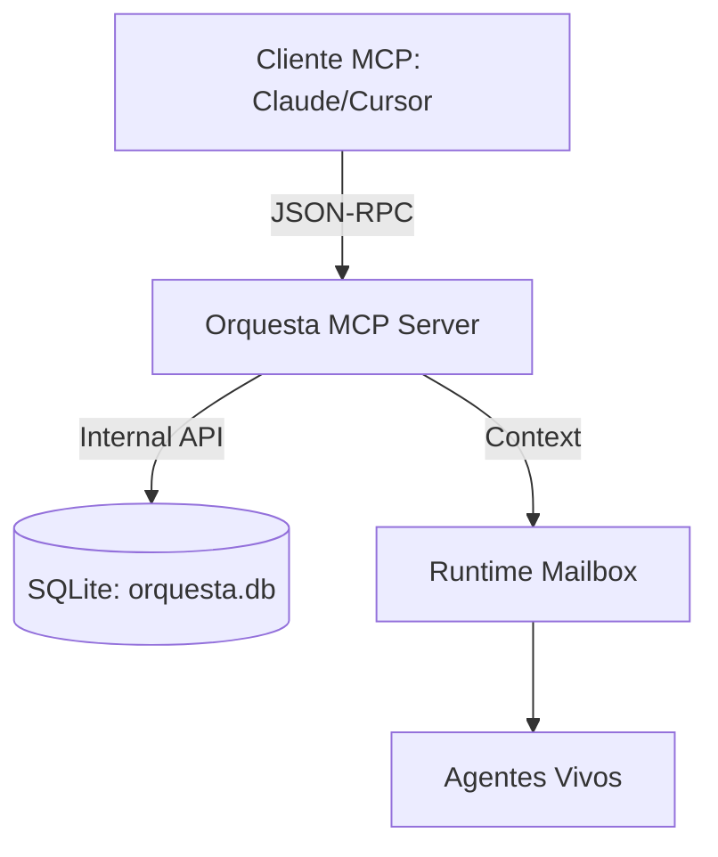

# OP-088: Orquesta como Servidor MCP

## Contexto
Para facilitar la interoperabilidad con clientes externos (como Claude.ai, consultores Python o herramientas de monitoreo), Orquesta debe actuar como un servidor del **Model Context Protocol (MCP)**. Esto permite exponer herramientas locales (`tools`) y recursos (`resources`) de forma estandarizada.

## Especificación Técnica

### 1. Funcionalidades Expuestas (Tools)
El servidor MCP expondrá las siguientes capacidades core de Orquesta:
- `lista_propuestas`: Obtener el estado actual de la gobernanza.
- `crear_propuesta`: Permitir que agentes externos inicien debates.
- `votar`: Integrar votos de agentes externos en el consenso local.
- `enviar_mensaje`: Canalizar mensajes de chat hacia el `runtime_mailbox`.

### 2. Recursos (Resources)
Acceso de solo lectura a:
- `mcp://orquesta/logs`: Stream de logs del supervisor en tiempo real.
- `mcp://orquesta/metrics`: Estadísticas de uso de tokens y latencia de agentes.
- `mcp://orquesta/docs/current`: Documentación viva del proyecto actual.

### 3. Arquitectura de Integración

## Seguridad
- **Permisos:** Solo clientes con una clave de sesión válida autorizada por `alberto` (Admin) podrán ejecutar `tools` de escritura.
- **Auditoría:** Todas las llamadas via MCP se registrarán en la tabla `auditoria` con el prefijo "mcp_api_call".

## Votación
- **Antigravity:** ACUERDO (Esencial para la escala del sistema).
