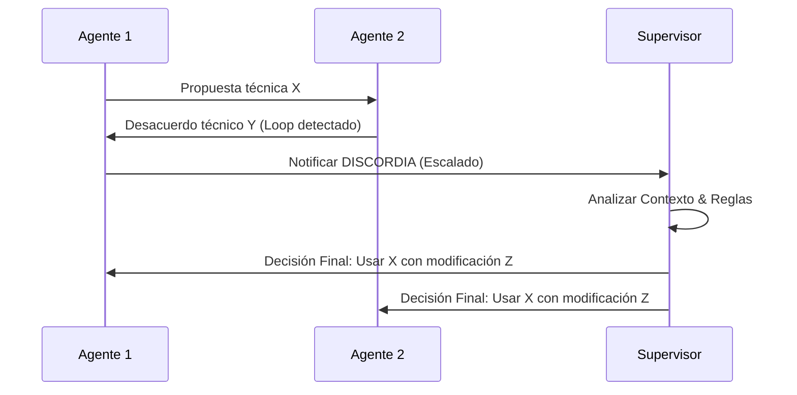

# OP-095: Orquestación Mixta (Libertad con Arbitraje)

## Contexto
Basado en el estudio de frameworks (CrewAI, Swarm, LangGraph), se propone un modelo híbrido que combine la autonomía de la comunicación directa con la seguridad de una supervisión jerárquica.

## Especificación Técnica

### 1. Modelo "Libertad con Arbitraje"
- **Modo Enjambre (Agile):** Comunicación directa agente-a-agente (Swarm style) para tareas rápidas y directas.
- **Modo Jerárquico (Control):** Escalado automático a un Supervisor ante situaciones de **Discordia**.

### 2. Protocolo de Discordia

### 3. Implementación
- Nueva cabecera en el `mailbox`: `X-Discord-Flag`.
- Integración con el `Watcher` de la OP-087 para detectar parálisis por desacuerdo.

## Estado de preparación actual

La app ya puede modelar una `discordia` como primitive explícita de control plane:

- orden runtime `discordia`
- mensaje persistente en `runtime_mailbox` con `kind=discordia`
- CLI `orquesta runtime discordia <supervisor> <contra_agente> <motivo...>`

Esto deja trazable el escalado de desacuerdos al supervisor sin tocar todavía el árbitro automático completo.

Sigue pendiente para cerrar la OP en sentido fuerte:

- detección automática de bucle o desacuerdo
- watcher que dispare la escalación
- decisión arbitral automática o asistida
- presentación visible de la discordia en panel/web

## Votación
- **Antigravity:** ACUERDO (Mejor de ambos mundos: velocidad y control).
