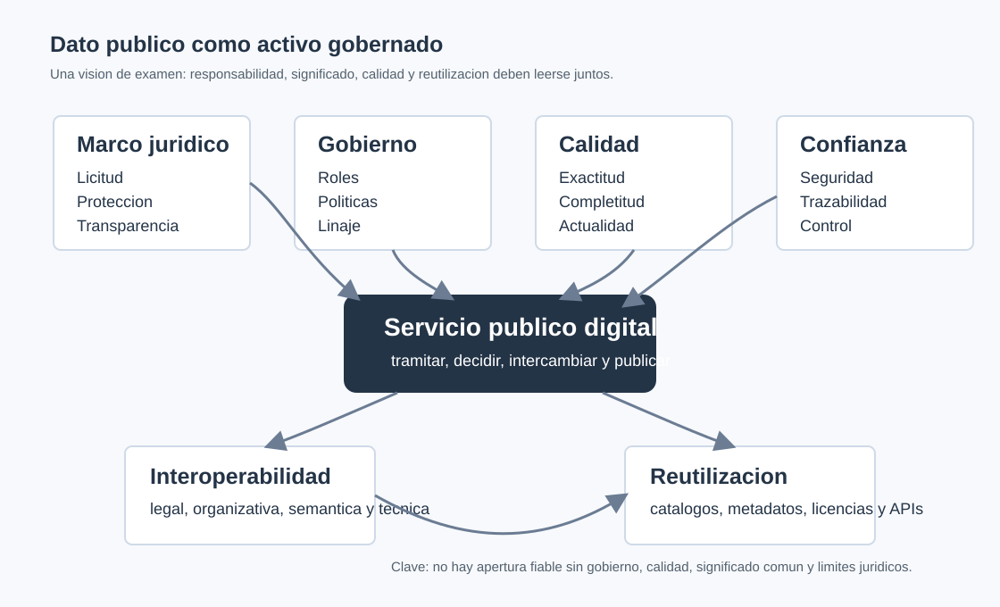

# Snippets HTML/CSS responsivos para integrar visuales

## Contenedor de esquema SVG

```html
<figure class="opes-figure opes-figure--wide" data-study-visual>
  <div class="opes-scroll-x" tabindex="0" aria-label="Esquema desplazable">
    
  </div>
  <figcaption>
    Relacion entre los cuatro ejes del tema: gobierno, interoperabilidad,
    calidad y reutilizacion.
  </figcaption>
</figure>
```

```css
.opes-figure {
  margin: 1.5rem 0;
}

.opes-figure figcaption {
  margin-top: .6rem;
  color: #4a5568;
  font-size: .95rem;
  line-height: 1.45;
}

.opes-scroll-x {
  overflow-x: auto;
  overscroll-behavior-inline: contain;
  border: 1px solid #d7dee8;
  border-radius: 8px;
  background: #ffffff;
}

.opes-svg-diagram {
  display: block;
  width: 100%;
  min-width: 760px;
  height: auto;
}

@media (max-width: 720px) {
  .opes-svg-diagram {
    min-width: 900px;
  }
}
```

## Tabla con lectura movil

```html
<div class="opes-table-wrap" tabindex="0" aria-label="Tabla comparativa desplazable">
  <table class="opes-table">
    <caption>Capas de interoperabilidad en la Administracion publica</caption>
    <thead>
      <tr>
        <th>Capa</th>
        <th>Que armoniza</th>
        <th>Ejemplo</th>
        <th>Confusion habitual</th>
      </tr>
    </thead>
    <tbody>
      <tr>
        <td>Semantica</td>
        <td>Significado de los datos</td>
        <td>Diccionario de datos, vocabulario comun</td>
        <td>Confundir significado con formato</td>
      </tr>
    </tbody>
  </table>
</div>
```

```css
.opes-table-wrap {
  overflow-x: auto;
  margin: 1.25rem 0;
  border: 1px solid #d7dee8;
  border-radius: 8px;
  background: #ffffff;
}

.opes-table {
  width: 100%;
  min-width: 720px;
  border-collapse: collapse;
  font-size: .95rem;
}

.opes-table caption {
  padding: .75rem 1rem;
  text-align: left;
  font-weight: 700;
  color: #243447;
  background: #f5f7fa;
}

.opes-table th,
.opes-table td {
  padding: .75rem 1rem;
  border-top: 1px solid #e4e9f0;
  vertical-align: top;
  line-height: 1.45;
}

.opes-table th {
  color: #243447;
  background: #eef3f8;
}
```

## Nota de test ocultable

```html
<details class="opes-test-note">
  <summary>Nota de test</summary>
  <p>
    Si el supuesto dice que la integracion transmite datos correctamente pero el
    receptor interpreta mal el significado, el problema es de interoperabilidad
    semantica, no solo tecnica.
  </p>
</details>
```

```css
.opes-test-note {
  margin: 1rem 0;
  padding: .9rem 1rem;
  border-left: 5px solid #2f6fed;
  border-radius: 6px;
  background: #eef5ff;
  color: #183153;
}

.opes-test-note summary {
  cursor: pointer;
  font-weight: 700;
}

.opes-test-note p {
  margin: .65rem 0 0;
}
```

## Modo tutor ocultable

```html
<details class="opes-tutor-note">
  <summary>Modo tutor</summary>
  <p>
    La calidad del dato debe leerse siempre respecto a una finalidad. Un dato
    puede bastar para estadistica agregada y no bastar para resolver derechos de
    una persona.
  </p>
</details>
```

```css
.opes-tutor-note {
  margin: 1rem 0 1.5rem;
  padding: .9rem 1rem;
  border: 1px solid #d9eadf;
  border-left: 5px solid #2e8b57;
  border-radius: 6px;
  background: #f2fbf5;
  color: #1f3d2b;
}

.opes-tutor-note summary {
  cursor: pointer;
  font-weight: 700;
}
```

## Supuesto practico con solucion plegable

```html
<section class="opes-case">
  <h3>Supuesto practico</h3>
  <p>
    Un organismo publica datos de subvenciones con identificadores internos,
    fechas de actualizacion irregulares y campos sin definir.
  </p>
  <details>
    <summary>Ver resolucion orientativa</summary>
    <ol>
      <li>Asignar responsable funcional y custodio tecnico.</li>
      <li>Definir diccionario de datos y metadatos.</li>
      <li>Aplicar controles de calidad y periodicidad.</li>
      <li>Evaluar limites de proteccion de datos y reutilizacion.</li>
    </ol>
  </details>
</section>
```

```css
.opes-case {
  margin: 1.5rem 0;
  padding: 1rem;
  border: 1px solid #e1e6ec;
  border-radius: 8px;
  background: #ffffff;
}

.opes-case h3 {
  margin-top: 0;
  font-size: 1.08rem;
}

.opes-case details {
  margin-top: .8rem;
}
```

## Recomendacion de sincronizacion

Los nombres de assets en HTML deben coincidir con los archivos locales que se
copien al directorio final `assets/`. Si el integrador cambia nombres, debe
actualizar `src`, `alt`, pies de figura y plan de visuales en Markdown. Las
tablas del Markdown deben conservar el mismo contenido que sus equivalentes HTML
si se publica una version final.
