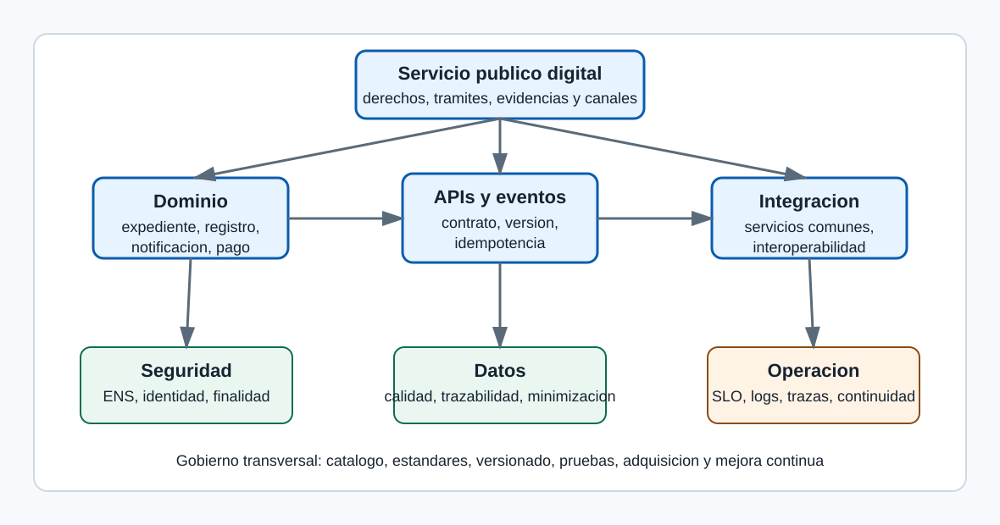

# Arquitecturas distribuidas, microservicios, APIs e integracion de sistemas en la Administracion publica

_Tema A1. Material de estudio profesional para primera lectura, repaso, supuestos y preparacion de examen._

## Indice

1. Orientacion de examen y enfoque de estudio
2. Mapa inicial del tema
3. Definiciones de autoridad operativa
4. Marco publico, finalidad y frontera juridica
5. Fundamentos de arquitectura distribuida
6. Microservicios: uso prudente en el sector publico
7. APIs: contratos, ciclo de vida y gobierno
8. Integracion de sistemas publicos
9. Seguridad, identidad y confianza
10. Operacion, continuidad y calidad de servicio
11. Gobierno tecnico, adquisicion y evolucion
12. Tablas de sintesis
13. Ejemplos trabajados
14. Supuestos practicos guiados
15. Notas de test separadas
16. Errores frecuentes
17. Repaso final
18. Plan de visuales
19. Fuentes oficiales

## Orientacion de examen y enfoque de estudio

Este tema debe estudiarse como un puente entre derecho publico, direccion tecnologica y diseño de sistemas. La pregunta de examen puede formularse de manera amplia, como arquitectura distribuida y microservicios, o aparecer escondida dentro de un supuesto sobre sede electronica, interoperabilidad, integracion de datos, seguridad, modernizacion de legacy o servicios comunes. La clave es no responder con una lista de productos ni con una defensa acrítica de una tecnologia.

Una contestacion A1 debe empezar por la finalidad publica: prestar servicios digitales fiables, interoperables, seguros, trazables y centrados en la ciudadania. Despues debe explicar como la arquitectura distribuye responsabilidades, como se comunican los componentes, que contratos gobiernan las APIs, como se protege el dato, que ocurre cuando falla una dependencia y como se opera el conjunto. El lenguaje debe mostrar criterio: hay que saber cuando conviene un microservicio, cuando basta un monolito modular, cuando usar una API sincrona, cuando usar eventos y cuando una integracion legacy debe encapsularse antes de sustituirse.

En test, los distractores suelen confundir microservicios con cualquier servicio pequeño, interoperabilidad con mera conectividad, autenticacion con autorizacion, disponibilidad con ausencia total de fallos, y API gateway con seguridad completa. En desarrollo, el riesgo es escribir parrafos tecnologicos sin conectar con ENI, ENS, procedimiento administrativo, proteccion de datos, servicios comunes y responsabilidad operativa. Para recordar el tema, conviene usar una secuencia: finalidad publica, contrato, dato, seguridad, operacion, gobierno y mejora.

> Modo tutor: Si tienes poco tiempo, no memorices nombres de tecnologias. Memoriza las preguntas que debe responder una arquitectura: que servicio publico sostiene, quien es responsable, que dato circula, con que base, por que contrato, con que seguridad, como se audita y que ocurre si falla.

> Nota de test: Si una opcion dice que los microservicios garantizan por si mismos escalabilidad, seguridad o interoperabilidad, normalmente es incompleta. Solo ayudan si existen fronteras adecuadas, contratos, observabilidad, automatizacion y gobierno.

## Mapa inicial del tema

El mapa del tema se puede imaginar como una cadena de responsabilidades. En el centro esta el servicio publico que la persona usuaria percibe: presentar, consultar, recibir, pagar, acreditar o ejercer un derecho. Debajo aparecen capacidades de dominio, como expediente, registro, resolucion o notificacion. Alrededor se situan APIs, eventos, servicios comunes, integraciones y plataformas de datos. Transversalmente actuan seguridad, interoperabilidad, observabilidad, proteccion de datos, accesibilidad, continuidad y gobierno.

| Capa | Pregunta directiva | Riesgo si se ignora | Evidencia esperada |

| --- | --- | --- | --- |

| Servicio publico | Que derecho, obligacion o prestacion se soporta | Tecnologia sin finalidad administrativa | Procedimiento, canal, responsable y nivel de servicio |

| Dominio | Que capacidades y datos son propios | Mezcla de reglas y dependencias opacas | Modelo de dominio, dato maestro y eventos |

| Contrato | Como se consume la capacidad | Integraciones informales | API, esquema, version, errores y condiciones de uso |

| Seguridad | Quien accede y con que finalidad | Accesos excesivos o no atribuibles | Identidad, autorizacion, auditoria y ENS |

| Operacion | Como se detectan y recuperan fallos | Servicio fragil aunque compile | SLO, logs, trazas, runbooks y continuidad |

| Gobierno | Como evoluciona sin romper consumidores | Proliferacion desordenada | Catalogo, versionado, deprecacion y responsables |

La tabla permite orientar casi cualquier pregunta. Si se pide explicar APIs, empieza por contrato y gobierno. Si se pide microservicios, empieza por dominio y operacion. Si se pide integracion interadministrativa, empieza por interoperabilidad, base juridica y significado del dato. Si se pide seguridad, no te quedes en cifrado; incluye identidad, finalidad, trazabilidad, ENS, proteccion de datos y continuidad.

## Definiciones de autoridad operativa

Las siguientes definiciones no sustituyen a las normas, pero ayudan a contestar con precision. Una definicion util en oposicion debe ser corta, comprensible y aplicable a un caso. Despues de definir, conviene añadir por que importa y con que se confunde.

| Concepto | Definicion util | Confusion habitual |
| --- | --- | --- |
| Arquitectura distribuida | Organizacion de un sistema en componentes separados que cooperan mediante comunicaciones de red y contratos explicitos. | Se confunde con cualquier aplicacion web; la diferencia relevante es la gestion de fallos parciales, consistencia, latencia y autonomia. |
| Microservicio | Servicio pequeño en responsabilidad, autonomo en despliegue razonable y alineado con una capacidad de dominio. | Se confunde con un modulo remoto; si comparte base de datos y ciclo de vida no tiene autonomia plena. |
| API | Interfaz programable que expone capacidades mediante un contrato documentado. | Se confunde con endpoint; una API madura incluye version, seguridad, errores, limites, documentacion y soporte. |
| Interoperabilidad | Capacidad de organizaciones y sistemas para compartir datos y procesos preservando significado, seguridad y responsabilidad. | Se confunde con conectividad; conectar no significa entender ni estar habilitado para usar. |
| Evento de dominio | Registro comunicable de un hecho relevante ocurrido en un dominio. | Se confunde con mensaje tecnico; el evento debe tener significado de negocio o administrativo. |
| Idempotencia | Propiedad de una operacion que permite repetirla sin efectos adicionales indebidos. | Se confunde con operacion sin efecto; puede crear algo la primera vez y reconocer repeticiones despues. |
| Observabilidad | Capacidad de conocer el estado del sistema a partir de metricas, logs, trazas y eventos. | Se confunde con tener muchos logs; importa la correlacion y la utilidad diagnostica. |
| ENS | Marco de seguridad aplicable al sector publico para proteger informacion y servicios en medios electronicos. | Se confunde con una certificacion aislada; debe impregnar diseño, operacion y ciclo de vida. |
| ENI | Marco que establece criterios y recomendaciones para interoperabilidad, conservacion y normalizacion. | Se confunde con estandares tecnicos solamente; incluye dimensiones organizativas, semanticas y de servicios comunes. |
| API gateway | Componente que aplica politicas transversales de entrada a APIs, como autenticacion, limites y enrutado. | Se confunde con seguridad completa; no reemplaza autorizacion fina ni reglas de dominio. |

> Modo tutor: Definir bien ahorra desarrollo confuso. En examen, escribe primero una frase precisa y despues añade una consecuencia practica. Esa segunda frase demuestra que no estas recitando.

## Marco publico, finalidad y frontera juridica

El estudio de las arquitecturas distribuidas en el sector publico no empieza por una tecnologia concreta, sino por la funcion administrativa que debe sostenerse: tramitar, informar, resolver, notificar, conservar evidencias y cooperar entre Administraciones con garantias.

La Administracion digital exige que cada sistema sea comprensible desde dos planos inseparables. El primero es juridico y organizativo: competencia, procedimiento, identificacion, seguridad, interoperabilidad, proteccion de datos, archivo y responsabilidad. El segundo es tecnico: servicios, contratos, integraciones, datos, operaciones y seguridad verificable.

Para un examen A1 conviene evitar una vision de moda. Microservicios, APIs, eventos o contenedores son medios. La respuesta madura identifica el problema publico, justifica el estilo de arquitectura y explica que controles impiden que la distribucion se convierta en fragilidad.

### Servicio publico digital como sistema socio-tecnico

Un servicio publico digital es una combinacion de normas, procesos, personas, datos, aplicaciones, infraestructura y evidencias que permite ejercer potestades o prestar servicios por medios electronicos. La arquitectura no puede aislarse del procedimiento administrativo, porque el acto, la notificacion, el expediente, el consentimiento, la representacion o la conservacion documental imponen requisitos que no aparecen en una aplicacion comercial ordinaria. Esta idea importa especialmente en Administracion publica porque los sistemas no solo procesan transacciones: sostienen derechos, obligaciones, plazos, evidencias, cooperacion entre organos y confianza institucional.

Un tramite de ayuda publica puede tener una interfaz sencilla, pero por debajo necesita validar identidad, consultar datos de otras Administraciones, registrar documentos, aplicar reglas de concurrencia, dejar trazas, emitir resoluciones y conservar el expediente. El diseño debe dejar claro que dato se usa, quien lo gobierna, que contrato permite consumirlo, que evidencias quedan y como se corrige una incidencia sin romper el procedimiento.

El error tipico es describir capas tecnicas sin explicar como se garantizan derechos, deberes y responsabilidades. Esa respuesta parece tecnica, pero queda incompleta para un cuerpo superior. La forma practica de evitarlo es inventariar dependencias, documentar contratos, probar integraciones, medir comportamiento real y asignar responsables funcionales y tecnicos.

> Modo tutor: Para reconocer este concepto, pregunta que frontera protege. Si protege significado, estas ante interoperabilidad semantica; si protege despliegue, ante autonomia; si protege recuperacion, ante resiliencia; si protege responsabilidad, ante auditoria y gobierno.

> Nota de test: Si el enunciado habla de Administracion electronica, no basta decir que se expone una API: hay que indicar que la API sirve a un procedimiento, a un dato o a una cooperacion administrativa concreta.

### Competencia, cooperacion e interoperabilidad

La interoperabilidad publica es la capacidad de organizaciones y sistemas para compartir datos y servicios respetando competencias, significado, seguridad y condiciones juridicas de uso. En el sector publico no se integra cualquier sistema con cualquier otro por conveniencia tecnica. La cooperacion requiere habilitacion, finalidad, minimizacion, trazabilidad y una interpretacion comun del dato. Esta idea importa especialmente en Administracion publica porque los sistemas no solo procesan transacciones: sostienen derechos, obligaciones, plazos, evidencias, cooperacion entre organos y confianza institucional.

La consulta de un dato de residencia o identidad puede evitar que la persona interesada aporte documentos, pero solo si el organo tramitador tiene base juridica, finalidad determinada y controles de acceso. El diseño debe dejar claro que dato se usa, quien lo gobierna, que contrato permite consumirlo, que evidencias quedan y como se corrige una incidencia sin romper el procedimiento.

Una integracion punto a punto sin gobierno semantico genera duplicidades, interpretaciones divergentes y costes de mantenimiento. A corto plazo parece rapida; a medio plazo impide escalar servicios publicos compartidos. La forma practica de evitarlo es inventariar dependencias, documentar contratos, probar integraciones, medir comportamiento real y asignar responsables funcionales y tecnicos.

> Modo tutor: Para reconocer este concepto, pregunta que frontera protege. Si protege significado, estas ante interoperabilidad semantica; si protege despliegue, ante autonomia; si protege recuperacion, ante resiliencia; si protege responsabilidad, ante auditoria y gobierno.

> Nota de test: Cuando aparezcan DIR3, SIA, CSV, intermediacion de datos o servicios comunes, piensa en interoperabilidad organizativa, semantica y tecnica, no solo en conectividad.

### Normativa como requisito de arquitectura

El marco normativo no es un anexo posterior: condiciona la identidad, la firma, la seguridad, la conservacion, la disponibilidad, la trazabilidad y la reutilizacion de soluciones. La Ley 39/2015, la Ley 40/2015, el RD 203/2021, el ENI y el ENS convierten principios publicos en requisitos arquitectonicos concretos. Una decision de versionado, almacenamiento o auditoria puede tener impacto juridico. Esta idea importa especialmente en Administracion publica porque los sistemas no solo procesan transacciones: sostienen derechos, obligaciones, plazos, evidencias, cooperacion entre organos y confianza institucional.

Si un servicio conserva documentos electronicos, no basta guardar ficheros en un repositorio. Debe preservar metadatos, integridad, vinculo con expediente, politica de firma y condiciones de recuperacion. El diseño debe dejar claro que dato se usa, quien lo gobierna, que contrato permite consumirlo, que evidencias quedan y como se corrige una incidencia sin romper el procedimiento.

Tratar la normativa como una lista de siglas conduce a respuestas memoristicas. Lo importante es explicar que cada norma resuelve un riesgo: validez, seguridad, interoperabilidad, evidencia o derechos de la ciudadania. La forma practica de evitarlo es inventariar dependencias, documentar contratos, probar integraciones, medir comportamiento real y asignar responsables funcionales y tecnicos.

> Modo tutor: Para reconocer este concepto, pregunta que frontera protege. Si protege significado, estas ante interoperabilidad semantica; si protege despliegue, ante autonomia; si protege recuperacion, ante resiliencia; si protege responsabilidad, ante auditoria y gobierno.

> Nota de test: Una buena respuesta nombra las normas principales, pero sobre todo las conecta con decisiones tecnicas verificables: autenticacion, autorizacion, catalogo, logs, evidencias, conservacion y acuerdos de nivel de servicio.

### Administracion como plataforma

La Administracion como plataforma organiza capacidades comunes reutilizables para que distintos servicios puedan construir sobre identidad, notificacion, registro, intermediacion, archivo, firma y datos compartidos. Este enfoque evita que cada unidad reinvente piezas transversales. Tambien facilita homogeneidad, seguridad, ahorro, mantenimiento y experiencia ciudadana coherente. Esta idea importa especialmente en Administracion publica porque los sistemas no solo procesan transacciones: sostienen derechos, obligaciones, plazos, evidencias, cooperacion entre organos y confianza institucional.

Un nuevo procedimiento no deberia implementar desde cero su sistema de identificacion, notificacion o verificacion de documentos si existen servicios comunes adecuados y vigentes. El diseño debe dejar claro que dato se usa, quien lo gobierna, que contrato permite consumirlo, que evidencias quedan y como se corrige una incidencia sin romper el procedimiento.

El riesgo inverso es convertir la plataforma en un cuello de botella. Por eso hacen falta contratos claros, catalogo, versionado, soporte, observabilidad y gobierno de cambios. La forma practica de evitarlo es inventariar dependencias, documentar contratos, probar integraciones, medir comportamiento real y asignar responsables funcionales y tecnicos.

> Modo tutor: Para reconocer este concepto, pregunta que frontera protege. Si protege significado, estas ante interoperabilidad semantica; si protege despliegue, ante autonomia; si protege recuperacion, ante resiliencia; si protege responsabilidad, ante auditoria y gobierno.

> Nota de test: La idea fuerza es reutilizacion gobernada. No significa centralizar todo, sino proporcionar capacidades comunes con autonomia suficiente para que los dominios evolucionen.

### Frontera entre producto, dominio y nucleo tecnico

En un sistema publico complejo conviene distinguir el dominio administrativo, las capacidades transversales y la infraestructura tecnica que las ejecuta. La separacion reduce dependencia entre reglas de negocio, canales de atencion, integraciones externas y plataforma de ejecucion. Permite sustituir piezas sin reescribir todo el servicio. Esta idea importa especialmente en Administracion publica porque los sistemas no solo procesan transacciones: sostienen derechos, obligaciones, plazos, evidencias, cooperacion entre organos y confianza institucional.

La regla para conceder una licencia pertenece al dominio del procedimiento; la autenticacion puede apoyarse en un servicio comun; la cola de mensajeria o el balanceador son infraestructura. El diseño debe dejar claro que dato se usa, quien lo gobierna, que contrato permite consumirlo, que evidencias quedan y como se corrige una incidencia sin romper el procedimiento.

Confundir dominio con infraestructura genera dependencia de proveedor, dificultad de auditoria y contratos opacos. Tambien impide reutilizar una capacidad en otros procedimientos. La forma practica de evitarlo es inventariar dependencias, documentar contratos, probar integraciones, medir comportamiento real y asignar responsables funcionales y tecnicos.

> Modo tutor: Para reconocer este concepto, pregunta que frontera protege. Si protege significado, estas ante interoperabilidad semantica; si protege despliegue, ante autonomia; si protege recuperacion, ante resiliencia; si protege responsabilidad, ante auditoria y gobierno.

> Nota de test: Cuando el caso proponga modernizar un monolito, explica que no todo debe convertirse en microservicio. Primero se identifican dominios, datos maestros, obligaciones legales y puntos de cambio real.

## Fundamentos de arquitectura distribuida

Una arquitectura distribuida reparte funciones entre componentes que cooperan a traves de red. Ese reparto puede aportar escalabilidad, autonomia y resiliencia, pero introduce latencia, fallos parciales, duplicidad de estado y mayor dificultad de observacion.

El examen suele premiar la respuesta que reconoce la tension: distribuir no es modernizar por definicion. Se distribuye cuando el beneficio organizativo y tecnico supera el coste de coordinar componentes autonomos.

### Acoplamiento y cohesion

La cohesion mide hasta que punto un componente concentra responsabilidades relacionadas; el acoplamiento mide cuanto depende de detalles de otros componentes. Una buena arquitectura publica busca alta cohesion en torno a capacidades administrativas y bajo acoplamiento entre servicios. Asi se puede cambiar un procedimiento, una integracion o una tecnologia sin afectar a todo el sistema. Esta idea importa especialmente en Administracion publica porque los sistemas no solo procesan transacciones: sostienen derechos, obligaciones, plazos, evidencias, cooperacion entre organos y confianza institucional.

Un servicio de expedientes debe conocer sus estados, metadatos y reglas de conservacion; no deberia depender de la estructura interna del servicio de notificaciones ni de la base de datos de identificacion. El diseño debe dejar claro que dato se usa, quien lo gobierna, que contrato permite consumirlo, que evidencias quedan y como se corrige una incidencia sin romper el procedimiento.

El falso microservicio aparece cuando se crean muchos despliegues pequeños que comparten tablas, librerias rigidas y ciclos de despliegue. Hay distribucion fisica, pero no autonomia real. La forma practica de evitarlo es inventariar dependencias, documentar contratos, probar integraciones, medir comportamiento real y asignar responsables funcionales y tecnicos.

> Modo tutor: Para reconocer este concepto, pregunta que frontera protege. Si protege significado, estas ante interoperabilidad semantica; si protege despliegue, ante autonomia; si protege recuperacion, ante resiliencia; si protege responsabilidad, ante auditoria y gobierno.

> Nota de test: Si se pregunta por ventajas de microservicios, matiza: las ventajas llegan si hay fronteras coherentes, contratos estables y gobierno; no por partir codigo al azar.

### Fallos parciales y latencia

En una red, un componente puede fallar, responder tarde o devolver informacion incompleta mientras el resto sigue funcionando. El sector publico debe diseñar para fallos parciales porque muchos tramites dependen de servicios comunes, plataformas de otras Administraciones o proveedores externos. Esta idea importa especialmente en Administracion publica porque los sistemas no solo procesan transacciones: sostienen derechos, obligaciones, plazos, evidencias, cooperacion entre organos y confianza institucional.

Si la consulta de un dato intermediado no esta disponible, el sistema puede reintentar, dejar la solicitud en estado pendiente, permitir aportacion documental subsidiaria o derivar a revision, segun la norma aplicable. El diseño debe dejar claro que dato se usa, quien lo gobierna, que contrato permite consumirlo, que evidencias quedan y como se corrige una incidencia sin romper el procedimiento.

El error es asumir que una llamada remota equivale a una llamada local. No lo es: hay timeout, reintento, duplicidad, caidas, mensajes fuera de orden y trazabilidad distribuida. La forma practica de evitarlo es inventariar dependencias, documentar contratos, probar integraciones, medir comportamiento real y asignar responsables funcionales y tecnicos.

> Modo tutor: Para reconocer este concepto, pregunta que frontera protege. Si protege significado, estas ante interoperabilidad semantica; si protege despliegue, ante autonomia; si protege recuperacion, ante resiliencia; si protege responsabilidad, ante auditoria y gobierno.

> Nota de test: Menciona patrones como timeout, circuit breaker, reintentos con backoff, idempotencia, colas y degradacion controlada cuando el supuesto incluya dependencias externas.

### Consistencia y disponibilidad

La consistencia expresa que los participantes observan el mismo estado relevante; la disponibilidad expresa que el sistema responde a pesar de fallos o particiones. No todos los datos publicos tienen el mismo perfil. Una resolucion administrativa exige fuerte control de integridad; una vista informativa puede tolerar cierta demora si se avisa adecuadamente. Esta idea importa especialmente en Administracion publica porque los sistemas no solo procesan transacciones: sostienen derechos, obligaciones, plazos, evidencias, cooperacion entre organos y confianza institucional.

La inscripcion de una solicitud en registro requiere garantias fuertes. En cambio, una estadistica agregada en un portal puede actualizarse de forma diferida sin lesionar derechos. El diseño debe dejar claro que dato se usa, quien lo gobierna, que contrato permite consumirlo, que evidencias quedan y como se corrige una incidencia sin romper el procedimiento.

Forzar consistencia fuerte en todo reduce escalabilidad y aumenta fragilidad. Relajarla sin criterio puede afectar derechos, plazos y seguridad juridica. La forma practica de evitarlo es inventariar dependencias, documentar contratos, probar integraciones, medir comportamiento real y asignar responsables funcionales y tecnicos.

> Modo tutor: Para reconocer este concepto, pregunta que frontera protege. Si protege significado, estas ante interoperabilidad semantica; si protege despliegue, ante autonomia; si protege recuperacion, ante resiliencia; si protege responsabilidad, ante auditoria y gobierno.

> Nota de test: La respuesta excelente diferencia datos transaccionales, datos de consulta, eventos de auditoria y proyecciones de lectura. No usa una regla unica para todo.

### Idempotencia

Una operacion idempotente puede repetirse sin producir efectos adicionales indebidos sobre el estado final. Los reintentos son inevitables en sistemas distribuidos. Sin idempotencia, un reintento puede duplicar solicitudes, pagos, asientos, notificaciones o eventos. Esta idea importa especialmente en Administracion publica porque los sistemas no solo procesan transacciones: sostienen derechos, obligaciones, plazos, evidencias, cooperacion entre organos y confianza institucional.

Un alta de solicitud puede usar un identificador de operacion proporcionado por el cliente o generado al iniciar el tramite. Si el mensaje se repite, el servicio reconoce la operacion y devuelve el resultado ya registrado. El diseño debe dejar claro que dato se usa, quien lo gobierna, que contrato permite consumirlo, que evidencias quedan y como se corrige una incidencia sin romper el procedimiento.

Confundir idempotencia con ausencia de efecto es un error. Una operacion idempotente puede crear una solicitud la primera vez; lo importante es que no cree otra distinta al repetirse. La forma practica de evitarlo es inventariar dependencias, documentar contratos, probar integraciones, medir comportamiento real y asignar responsables funcionales y tecnicos.

> Modo tutor: Para reconocer este concepto, pregunta que frontera protege. Si protege significado, estas ante interoperabilidad semantica; si protege despliegue, ante autonomia; si protege recuperacion, ante resiliencia; si protege responsabilidad, ante auditoria y gobierno.

> Nota de test: Relaciona idempotencia con reintentos, colas, APIs de escritura, integracion asincrona y recuperacion tras caidas.

### Observabilidad

La observabilidad es la capacidad de inferir el estado interno del sistema a partir de logs, metricas, trazas y eventos de negocio. En Administracion publica, observar no es solo detectar errores tecnicos. Tambien permite reconstruir una actuacion, explicar un retraso, auditar accesos y mejorar niveles de servicio. Esta idea importa especialmente en Administracion publica porque los sistemas no solo procesan transacciones: sostienen derechos, obligaciones, plazos, evidencias, cooperacion entre organos y confianza institucional.

Una solicitud que pasa por portal, API, gestor de expedientes, intermediacion de datos y notificacion debe conservar un identificador de correlacion que permita seguir el flujo sin exponer datos personales innecesarios. El diseño debe dejar claro que dato se usa, quien lo gobierna, que contrato permite consumirlo, que evidencias quedan y como se corrige una incidencia sin romper el procedimiento.

Muchos sistemas tienen logs, pero no observabilidad. Si cada componente usa identificadores distintos, formatos incompatibles o mensajes ambiguos, la investigacion posterior se vuelve manual. La forma practica de evitarlo es inventariar dependencias, documentar contratos, probar integraciones, medir comportamiento real y asignar responsables funcionales y tecnicos.

> Modo tutor: Para reconocer este concepto, pregunta que frontera protege. Si protege significado, estas ante interoperabilidad semantica; si protege despliegue, ante autonomia; si protege recuperacion, ante resiliencia; si protege responsabilidad, ante auditoria y gobierno.

> Nota de test: Cita logs estructurados, metricas de servicio, trazas distribuidas, correlacion, retencion, proteccion de datos y cuadro de mando operativo.

## Microservicios: uso prudente en el sector publico

Un microservicio no es simplemente una aplicacion pequeña. Es una unidad de capacidad de negocio o administrativa, desplegable de forma independiente, con contrato explicito, datos gobernados y responsabilidad operativa clara.

En la Administracion publica, los microservicios tienen sentido cuando hay dominios diferenciados, necesidad de evolucion independiente, carga desigual, equipos capaces de operar servicios y mecanismos de gobierno que impiden la proliferacion desordenada.

### Microservicio frente a monolito modular

Un monolito modular mantiene un despliegue unico pero separa internamente modulos; una arquitectura de microservicios separa tambien despliegue, ciclo de vida y comunicacion por red. No todo sistema debe empezar distribuido. Un monolito modular puede ser mas simple, barato y robusto si el dominio no exige autonomia de despliegue ni escalado independiente. Esta idea importa especialmente en Administracion publica porque los sistemas no solo procesan transacciones: sostienen derechos, obligaciones, plazos, evidencias, cooperacion entre organos y confianza institucional.

Una aplicacion departamental pequeña con pocas integraciones puede funcionar mejor como monolito modular bien diseñado. Un ecosistema de servicios comunes con muchos consumidores puede justificar microservicios. El diseño debe dejar claro que dato se usa, quien lo gobierna, que contrato permite consumirlo, que evidencias quedan y como se corrige una incidencia sin romper el procedimiento.

Migrar prematuramente genera operaciones complejas, mas puntos de fallo y costes de coordinacion. La modernizacion responsable puede empezar por modularizar, medir dependencias y extraer servicios solo donde exista valor. La forma practica de evitarlo es inventariar dependencias, documentar contratos, probar integraciones, medir comportamiento real y asignar responsables funcionales y tecnicos.

> Modo tutor: Para reconocer este concepto, pregunta que frontera protege. Si protege significado, estas ante interoperabilidad semantica; si protege despliegue, ante autonomia; si protege recuperacion, ante resiliencia; si protege responsabilidad, ante auditoria y gobierno.

> Nota de test: Si el supuesto pide microservicios, no aceptes la premisa sin matiz. Explica criterios de adopcion y casos donde un monolito modular seria preferible.

### Fronteras de dominio

La frontera de dominio delimita que conceptos, reglas, datos y responsabilidades pertenecen a un servicio. Una frontera bien elegida reduce cambios cruzados y evita que cada servicio conozca detalles internos de los demas. En lo publico, ademas, ayuda a asignar responsabilidad sobre datos y decisiones. Esta idea importa especialmente en Administracion publica porque los sistemas no solo procesan transacciones: sostienen derechos, obligaciones, plazos, evidencias, cooperacion entre organos y confianza institucional.

Identidad, registro, expediente, notificacion, pago, archivo o intermediacion son capacidades con reglas propias. Mezclarlas en un servicio generico de tramite dificulta evolucionar cada una. El diseño debe dejar claro que dato se usa, quien lo gobierna, que contrato permite consumirlo, que evidencias quedan y como se corrige una incidencia sin romper el procedimiento.

Dividir por capas tecnicas, como controlador, servicio y repositorio separados en procesos distintos, produce mucha comunicacion y poca autonomia. Es un antipatron frecuente. La forma practica de evitarlo es inventariar dependencias, documentar contratos, probar integraciones, medir comportamiento real y asignar responsables funcionales y tecnicos.

> Modo tutor: Para reconocer este concepto, pregunta que frontera protege. Si protege significado, estas ante interoperabilidad semantica; si protege despliegue, ante autonomia; si protege recuperacion, ante resiliencia; si protege responsabilidad, ante auditoria y gobierno.

> Nota de test: Usa vocabulario de dominio: capacidad, responsabilidad, dato maestro, evento, contrato y propietario funcional.

### Datos por servicio y consistencia

El principio de datos por servicio asigna a cada microservicio la autoridad sobre su modelo persistente, evitando que otros servicios escriban directamente en sus tablas. La autonomia real exige que el contrato sea la API o el evento, no la base de datos compartida. Asi se preserva el significado del dato y se controla su evolucion. Esta idea importa especialmente en Administracion publica porque los sistemas no solo procesan transacciones: sostienen derechos, obligaciones, plazos, evidencias, cooperacion entre organos y confianza institucional.

El servicio de notificaciones puede exponer el estado de puesta a disposicion y comparecencia; otros sistemas no deberian modificar sus tablas para forzar estados. El diseño debe dejar claro que dato se usa, quien lo gobierna, que contrato permite consumirlo, que evidencias quedan y como se corrige una incidencia sin romper el procedimiento.

La base de datos compartida parece eficiente, pero crea acoplamiento oculto, bloquea despliegues y dificulta auditoria. Puede ser aceptable temporalmente en migracion, pero debe declararse deuda controlada. La forma practica de evitarlo es inventariar dependencias, documentar contratos, probar integraciones, medir comportamiento real y asignar responsables funcionales y tecnicos.

> Modo tutor: Para reconocer este concepto, pregunta que frontera protege. Si protege significado, estas ante interoperabilidad semantica; si protege despliegue, ante autonomia; si protege recuperacion, ante resiliencia; si protege responsabilidad, ante auditoria y gobierno.

> Nota de test: Relaciona este punto con eventos de dominio, vistas materializadas, sincronizacion asincrona y gobierno de datos.

### Despliegue independiente y responsabilidad operativa

Un microservicio debe poder versionarse, probarse, desplegarse, monitorizarse y revertirse con independencia razonable. La independencia tecnica sin responsabilidad operativa es incompleta. Cada servicio necesita propietarios, indicadores, documentacion, guardias o soporte, y acuerdos de nivel de servicio proporcionados a su criticidad. Esta idea importa especialmente en Administracion publica porque los sistemas no solo procesan transacciones: sostienen derechos, obligaciones, plazos, evidencias, cooperacion entre organos y confianza institucional.

Si una API de validacion de datos es usada por cien tramites, su despliegue exige pruebas de compatibilidad, publicacion de cambios, monitorizacion y plan de retorno. El diseño debe dejar claro que dato se usa, quien lo gobierna, que contrato permite consumirlo, que evidencias quedan y como se corrige una incidencia sin romper el procedimiento.

Un ecosistema de microservicios sin plataforma comun termina con estilos distintos de logs, seguridad, configuracion y despliegue. Eso aumenta el riesgo de incidentes. La forma practica de evitarlo es inventariar dependencias, documentar contratos, probar integraciones, medir comportamiento real y asignar responsables funcionales y tecnicos.

> Modo tutor: Para reconocer este concepto, pregunta que frontera protege. Si protege significado, estas ante interoperabilidad semantica; si protege despliegue, ante autonomia; si protege recuperacion, ante resiliencia; si protege responsabilidad, ante auditoria y gobierno.

> Nota de test: No presentes microservicios solo como patron de codigo. Añade CI/CD, observabilidad, seguridad, catalogo, gobierno de cambios y soporte.

### Granularidad

La granularidad decide el tamaño funcional de un servicio y la cantidad de responsabilidad que asume. Un servicio demasiado grande pierde autonomia; uno demasiado pequeño multiplica llamadas, contratos y despliegues. La granularidad correcta surge de frecuencia de cambio, cohesion, carga, reglas y propiedad. Esta idea importa especialmente en Administracion publica porque los sistemas no solo procesan transacciones: sostienen derechos, obligaciones, plazos, evidencias, cooperacion entre organos y confianza institucional.

Separar calculo de tasas puede tener sentido si cambia con frecuencia o se reutiliza. Separar cada validacion elemental en un servicio distinto suele ser excesivo. El diseño debe dejar claro que dato se usa, quien lo gobierna, que contrato permite consumirlo, que evidencias quedan y como se corrige una incidencia sin romper el procedimiento.

El nano-servicio es un microservicio sin masa critica: aumenta complejidad sin mejorar independencia. En el sector publico puede hacer mas dificil certificar, auditar y mantener. La forma practica de evitarlo es inventariar dependencias, documentar contratos, probar integraciones, medir comportamiento real y asignar responsables funcionales y tecnicos.

> Modo tutor: Para reconocer este concepto, pregunta que frontera protege. Si protege significado, estas ante interoperabilidad semantica; si protege despliegue, ante autonomia; si protege recuperacion, ante resiliencia; si protege responsabilidad, ante auditoria y gobierno.

> Nota de test: Explica que la granularidad se revisa con evidencia operativa. No es una decision estetica ni una regla de numero de lineas.

## APIs: contratos, ciclo de vida y gobierno

Una API es un contrato de interaccion. Define que capacidades se ofrecen, con que semantica, bajo que condiciones de seguridad, versionado, cuota, trazabilidad y soporte.

En la Administracion publica, una API puede ser interna, interadministrativa o publica. Esa clasificacion afecta a autenticacion, autorizacion, documentacion, acuerdo de uso, proteccion de datos y responsabilidad ante errores.

### API como contrato estable

El contrato de API describe recursos, operaciones, parametros, respuestas, errores, seguridad, limites y garantias esperadas. La estabilidad contractual permite que consumidores distintos integren servicios sin conocer la implementacion. Tambien facilita pruebas, documentacion, generacion de clientes y control de cambios. Esta idea importa especialmente en Administracion publica porque los sistemas no solo procesan transacciones: sostienen derechos, obligaciones, plazos, evidencias, cooperacion entre organos y confianza institucional.

Una API de consulta de expedientes debe definir estados, filtros, paginacion, codigos de error y significado de cada campo. Si un campo cambia de significado sin versionar, los consumidores fallan silenciosamente. El diseño debe dejar claro que dato se usa, quien lo gobierna, que contrato permite consumirlo, que evidencias quedan y como se corrige una incidencia sin romper el procedimiento.

Publicar endpoints sin contrato formal produce dependencia informal. El problema aparece cuando hay que cambiar el servicio o investigar una incidencia. La forma practica de evitarlo es inventariar dependencias, documentar contratos, probar integraciones, medir comportamiento real y asignar responsables funcionales y tecnicos.

> Modo tutor: Para reconocer este concepto, pregunta que frontera protege. Si protege significado, estas ante interoperabilidad semantica; si protege despliegue, ante autonomia; si protege recuperacion, ante resiliencia; si protege responsabilidad, ante auditoria y gobierno.

> Nota de test: Menciona OpenAPI para APIs HTTP, catalogo de APIs, ejemplos de peticion y respuesta, pruebas de contrato y politica de versionado.

### Semantica HTTP

HTTP ofrece metodos, codigos de estado, cabeceras, representaciones y reglas de cache que permiten una interfaz uniforme. Usar bien HTTP mejora interoperabilidad. No todo debe enviarse como POST generico ni toda respuesta debe devolver un codigo de exito con un error dentro. Esta idea importa especialmente en Administracion publica porque los sistemas no solo procesan transacciones: sostienen derechos, obligaciones, plazos, evidencias, cooperacion entre organos y confianza institucional.

Una consulta usa GET si no altera estado; una creacion puede usar POST; una sustitucion completa puede usar PUT; una ausencia real puede devolver 404; una validacion fallida puede devolver un error de negocio claro. El diseño debe dejar claro que dato se usa, quien lo gobierna, que contrato permite consumirlo, que evidencias quedan y como se corrige una incidencia sin romper el procedimiento.

La mala semantica crea integraciones fragiles, dificulta observabilidad y rompe intermediarios como caches, proxies o pasarelas. La forma practica de evitarlo es inventariar dependencias, documentar contratos, probar integraciones, medir comportamiento real y asignar responsables funcionales y tecnicos.

> Modo tutor: Para reconocer este concepto, pregunta que frontera protege. Si protege significado, estas ante interoperabilidad semantica; si protege despliegue, ante autonomia; si protege recuperacion, ante resiliencia; si protege responsabilidad, ante auditoria y gobierno.

> Nota de test: Diferencia seguridad del metodo, idempotencia del metodo y autorizacion. GET puede estar protegido; idempotente no significa publico.

### Versionado y compatibilidad

Versionar una API es gestionar cambios de forma que los consumidores puedan adaptarse sin interrupciones indebidas. Los sistemas publicos tienen ciclos largos, multiples organizaciones consumidoras y obligaciones de continuidad. Cambios incompatibles requieren comunicacion, ventana de convivencia y plan de retirada. Esta idea importa especialmente en Administracion publica porque los sistemas no solo procesan transacciones: sostienen derechos, obligaciones, plazos, evidencias, cooperacion entre organos y confianza institucional.

Añadir un campo opcional puede ser compatible. Cambiar el tipo de un identificador, eliminar un estado o modificar el significado de un codigo puede exigir nueva version. El diseño debe dejar claro que dato se usa, quien lo gobierna, que contrato permite consumirlo, que evidencias quedan y como se corrige una incidencia sin romper el procedimiento.

Versionar demasiado crea fragmentacion; no versionar cambios incompatibles rompe servicios. La respuesta madura propone criterios y calendario. La forma practica de evitarlo es inventariar dependencias, documentar contratos, probar integraciones, medir comportamiento real y asignar responsables funcionales y tecnicos.

> Modo tutor: Para reconocer este concepto, pregunta que frontera protege. Si protege significado, estas ante interoperabilidad semantica; si protege despliegue, ante autonomia; si protege recuperacion, ante resiliencia; si protege responsabilidad, ante auditoria y gobierno.

> Nota de test: Cita versionado semantico de contrato, deprecacion, pruebas de regresion, guia de migracion y registro de consumidores afectados.

### Autenticacion, autorizacion y ambito

La autenticacion identifica al sujeto o sistema; la autorizacion decide que puede hacer; el ambito limita el uso permitido de una credencial o token. Una API publica no debe confundir tener token con tener competencia o finalidad. La autorizacion debe incorporar rol, organismo, procedimiento, dato solicitado y base habilitante cuando proceda. Esta idea importa especialmente en Administracion publica porque los sistemas no solo procesan transacciones: sostienen derechos, obligaciones, plazos, evidencias, cooperacion entre organos y confianza institucional.

Un sistema municipal que consulta datos para un tramite concreto puede estar autorizado para ciertos servicios y no para consultas masivas o finalidades distintas. El diseño debe dejar claro que dato se usa, quien lo gobierna, que contrato permite consumirlo, que evidencias quedan y como se corrige una incidencia sin romper el procedimiento.

La seguridad basada solo en red o en una clave compartida no basta para servicios sensibles. Deben existir identidad robusta, trazabilidad, rotacion, minimizacion y auditoria. La forma practica de evitarlo es inventariar dependencias, documentar contratos, probar integraciones, medir comportamiento real y asignar responsables funcionales y tecnicos.

> Modo tutor: Para reconocer este concepto, pregunta que frontera protege. Si protege significado, estas ante interoperabilidad semantica; si protege despliegue, ante autonomia; si protege recuperacion, ante resiliencia; si protege responsabilidad, ante auditoria y gobierno.

> Nota de test: Relaciona OAuth 2.0, OIDC, certificados, mTLS, scopes, claims, control de finalidad y registro de accesos.

### API gateway y gestion de trafico

Una pasarela de APIs centraliza funciones transversales como autenticacion, autorizacion inicial, limitacion de tasa, transformacion, enrutado, registro y proteccion. Permite aplicar politicas coherentes sin replicar controles en cada servicio. Tambien da visibilidad sobre consumidores, errores y volumen. Esta idea importa especialmente en Administracion publica porque los sistemas no solo procesan transacciones: sostienen derechos, obligaciones, plazos, evidencias, cooperacion entre organos y confianza institucional.

Una pasarela puede limitar peticiones por organismo, validar tokens, rechazar payloads excesivos y registrar un identificador de correlacion antes de enviar la peticion al servicio interno. El diseño debe dejar claro que dato se usa, quien lo gobierna, que contrato permite consumirlo, que evidencias quedan y como se corrige una incidencia sin romper el procedimiento.

La pasarela no sustituye al control de negocio. El servicio final debe validar permisos finos y reglas de dominio, porque la pasarela no conoce todo el contexto administrativo. La forma practica de evitarlo es inventariar dependencias, documentar contratos, probar integraciones, medir comportamiento real y asignar responsables funcionales y tecnicos.

> Modo tutor: Para reconocer este concepto, pregunta que frontera protege. Si protege significado, estas ante interoperabilidad semantica; si protege despliegue, ante autonomia; si protege recuperacion, ante resiliencia; si protege responsabilidad, ante auditoria y gobierno.

> Nota de test: Distingue seguridad perimetral, seguridad de servicio y autorizacion de dominio. El gateway ayuda, pero no agota el modelo.

## Integracion de sistemas publicos

Integrar sistemas es hacer que capacidades autonomas cooperen sin perder significado, seguridad ni responsabilidad. En la Administracion, la integracion persigue simplificar servicios, evitar aportacion repetida de documentos, compartir evidencias y asegurar continuidad entre niveles territoriales.

La integracion moderna combina APIs sincronas, mensajeria asincrona, eventos, intercambio documental, servicios comunes, catalogos y gobierno semantico. La decision correcta depende de volumen, criticidad, latencia, trazabilidad, propiedad del dato y efectos juridicos.

### Interoperabilidad organizativa, semantica y tecnica

La capa organizativa alinea procesos y responsabilidades; la semantica alinea significado de datos; la tecnica alinea protocolos, formatos y mecanismos de intercambio. La conexion tecnica no garantiza interoperabilidad si cada organismo entiende de modo distinto un estado, un domicilio, una unidad organica o una fecha de efectos. Esta idea importa especialmente en Administracion publica porque los sistemas no solo procesan transacciones: sostienen derechos, obligaciones, plazos, evidencias, cooperacion entre organos y confianza institucional.

Un estado llamado resuelto puede significar resolucion emitida, notificada, firme o pagada. La API debe definirlo con precision para evitar errores de procedimiento. El diseño debe dejar claro que dato se usa, quien lo gobierna, que contrato permite consumirlo, que evidencias quedan y como se corrige una incidencia sin romper el procedimiento.

Centrarse solo en protocolos deja sin resolver el significado. Cualquier integracion A1 debe explicar modelo de datos, catalogos, metadatos y acuerdos organizativos. La forma practica de evitarlo es inventariar dependencias, documentar contratos, probar integraciones, medir comportamiento real y asignar responsables funcionales y tecnicos.

> Modo tutor: Para reconocer este concepto, pregunta que frontera protege. Si protege significado, estas ante interoperabilidad semantica; si protege despliegue, ante autonomia; si protege recuperacion, ante resiliencia; si protege responsabilidad, ante auditoria y gobierno.

> Nota de test: Si aparece el Marco Europeo de Interoperabilidad, recuerda sus capas legal, organizativa, semantica y tecnica. En España enlaza con ENI y normas tecnicas.

### Intermediacion de datos

La intermediacion permite consultar o verificar datos que ya obran en poder de una Administracion, evitando al ciudadano aportar documentos cuando proceda. Es una pieza central de simplificacion administrativa, pero exige habilitacion, finalidad, consentimiento cuando sea necesario, seguridad y trazabilidad. Esta idea importa especialmente en Administracion publica porque los sistemas no solo procesan transacciones: sostienen derechos, obligaciones, plazos, evidencias, cooperacion entre organos y confianza institucional.

Un organo tramitador puede verificar identidad, residencia, discapacidad, titulos o cumplimiento tributario mediante servicios habilitados, segun el procedimiento y los convenios aplicables. El diseño debe dejar claro que dato se usa, quien lo gobierna, que contrato permite consumirlo, que evidencias quedan y como se corrige una incidencia sin romper el procedimiento.

Convertir la intermediacion en consulta indiscriminada vulnera principios de minimizacion y finalidad. Tambien puede generar dependencia operativa si no hay planes de contingencia. La forma practica de evitarlo es inventariar dependencias, documentar contratos, probar integraciones, medir comportamiento real y asignar responsables funcionales y tecnicos.

> Modo tutor: Para reconocer este concepto, pregunta que frontera protege. Si protege significado, estas ante interoperabilidad semantica; si protege despliegue, ante autonomia; si protege recuperacion, ante resiliencia; si protege responsabilidad, ante auditoria y gobierno.

> Nota de test: Menciona PID, Red SARA, trazabilidad, consentimiento o base juridica, no aportacion de documentos y controles de acceso.

### Mensajeria y colas

La mensajeria asincrona desacopla productores y consumidores mediante mensajes persistentes, colas o topicos. Es util cuando la respuesta inmediata no es necesaria o cuando interesa absorber picos, reintentar, ordenar flujos y aislar fallos. Esta idea importa especialmente en Administracion publica porque los sistemas no solo procesan transacciones: sostienen derechos, obligaciones, plazos, evidencias, cooperacion entre organos y confianza institucional.

Tras registrar una solicitud, el sistema puede publicar un evento para generar acuse, lanzar comprobaciones, actualizar un cuadro de mando o iniciar una notificacion sin bloquear la pantalla del usuario. El diseño debe dejar claro que dato se usa, quien lo gobierna, que contrato permite consumirlo, que evidencias quedan y como se corrige una incidencia sin romper el procedimiento.

La asincronia exige idempotencia, tratamiento de duplicados, gestion de errores, monitorizacion de colas y criterios de reconciliacion. La forma practica de evitarlo es inventariar dependencias, documentar contratos, probar integraciones, medir comportamiento real y asignar responsables funcionales y tecnicos.

> Modo tutor: Para reconocer este concepto, pregunta que frontera protege. Si protege significado, estas ante interoperabilidad semantica; si protege despliegue, ante autonomia; si protege recuperacion, ante resiliencia; si protege responsabilidad, ante auditoria y gobierno.

> Nota de test: No digas solo que una cola mejora rendimiento. Explica que modifica el modelo de consistencia y requiere gobierno operativo.

### ESB, integracion tradicional y modernizacion

Un bus de servicios empresarial concentra enrutado, transformaciones y coordinacion de integraciones. Puede convivir con APIs y eventos si se gobierna adecuadamente. Muchas Administraciones tienen integraciones legacy. La modernizacion no consiste en eliminarlas de golpe, sino en encapsular, medir dependencias y exponer contratos mas claros. Esta idea importa especialmente en Administracion publica porque los sistemas no solo procesan transacciones: sostienen derechos, obligaciones, plazos, evidencias, cooperacion entre organos y confianza institucional.

Un sistema antiguo de gestion tributaria puede seguir operando mientras una capa de APIs controla acceso, traduce formatos y registra trazas para nuevos consumidores. El diseño debe dejar claro que dato se usa, quien lo gobierna, que contrato permite consumirlo, que evidencias quedan y como se corrige una incidencia sin romper el procedimiento.

El ESB puede convertirse en monolito de integracion si acumula logica de negocio opaca. Tambien una malla de microservicios puede repetir ese error si cada servicio transforma datos sin criterio comun. La forma practica de evitarlo es inventariar dependencias, documentar contratos, probar integraciones, medir comportamiento real y asignar responsables funcionales y tecnicos.

> Modo tutor: Para reconocer este concepto, pregunta que frontera protege. Si protege significado, estas ante interoperabilidad semantica; si protege despliegue, ante autonomia; si protege recuperacion, ante resiliencia; si protege responsabilidad, ante auditoria y gobierno.

> Nota de test: Plantea coexistencia ordenada: inventario, catalogo, contrato, retirada gradual y pruebas de regresion.

### Servicios comunes y codigos de referencia

Servicios comunes y codigos como DIR3, SIA o CSV aportan identificacion comun de unidades, procedimientos, documentos o verificaciones. Sin referencias compartidas, cada organismo crea codigos propios y la interoperabilidad semantica se rompe. La arquitectura debe tratarlos como datos maestros o referencias controladas. Esta idea importa especialmente en Administracion publica porque los sistemas no solo procesan transacciones: sostienen derechos, obligaciones, plazos, evidencias, cooperacion entre organos y confianza institucional.

Un expediente que viaja entre sistemas debe conservar identificadores de organo, procedimiento y documento que otros sistemas puedan reconocer. El diseño debe dejar claro que dato se usa, quien lo gobierna, que contrato permite consumirlo, que evidencias quedan y como se corrige una incidencia sin romper el procedimiento.

Copiar catalogos sin sincronizacion o usar campos libres genera inconsistencias. Hay que definir fuente autorizada, frecuencia de actualizacion y tratamiento de historicos. La forma practica de evitarlo es inventariar dependencias, documentar contratos, probar integraciones, medir comportamiento real y asignar responsables funcionales y tecnicos.

> Modo tutor: Para reconocer este concepto, pregunta que frontera protege. Si protege significado, estas ante interoperabilidad semantica; si protege despliegue, ante autonomia; si protege recuperacion, ante resiliencia; si protege responsabilidad, ante auditoria y gobierno.

> Nota de test: Relaciona servicios comunes con simplificacion, trazabilidad, reuso y coherencia administrativa.

## Seguridad, identidad y confianza

La seguridad en arquitecturas distribuidas no puede delegarse a un unico perimetro. Cada servicio, canal, integracion y dato debe participar en un modelo de confianza coherente.

El ENS aporta principios basicos y requisitos minimos. eIDAS y su evolucion europea refuerzan identidad y servicios de confianza. La proteccion de datos exige minimizacion, base juridica, informacion, medidas tecnicas y organizativas, y responsabilidad demostrable.

### ENS aplicado a servicios distribuidos

El ENS establece una politica de seguridad para el uso de medios electronicos en el sector publico, basada en principios, requisitos minimos y medidas proporcionadas. En microservicios, cada componente forma parte de la cadena de seguridad. No basta certificar el portal si las APIs internas, colas, registros o secretos quedan fuera de control. Esta idea importa especialmente en Administracion publica porque los sistemas no solo procesan transacciones: sostienen derechos, obligaciones, plazos, evidencias, cooperacion entre organos y confianza institucional.

Una plataforma de integracion debe controlar autenticacion, autorizacion, trazabilidad, proteccion de comunicaciones, gestion de vulnerabilidades, continuidad y auditoria. El diseño debe dejar claro que dato se usa, quien lo gobierna, que contrato permite consumirlo, que evidencias quedan y como se corrige una incidencia sin romper el procedimiento.

Fragmentar servicios sin gobierno de seguridad produce superficies de ataque nuevas. Las dependencias entre servicios deben inventariarse y protegerse. La forma practica de evitarlo es inventariar dependencias, documentar contratos, probar integraciones, medir comportamiento real y asignar responsables funcionales y tecnicos.

> Modo tutor: Para reconocer este concepto, pregunta que frontera protege. Si protege significado, estas ante interoperabilidad semantica; si protege despliegue, ante autonomia; si protege recuperacion, ante resiliencia; si protege responsabilidad, ante auditoria y gobierno.

> Nota de test: Une ENS con categorizacion, analisis de riesgos, medidas, auditoria, continuidad, proteccion de informacion y servicios.

### Zero trust y minimo privilegio

El enfoque de confianza cero evita asumir que una peticion es fiable solo por venir de una red interna. Las arquitecturas distribuidas multiplican llamadas internas. Cada llamada debe autenticarse, autorizarse, registrarse y limitarse segun contexto. Esta idea importa especialmente en Administracion publica porque los sistemas no solo procesan transacciones: sostienen derechos, obligaciones, plazos, evidencias, cooperacion entre organos y confianza institucional.

Un servicio de expedientes que llama a notificaciones debe presentar una identidad de servicio, un ambito permitido y un identificador de operacion. La red privada no sustituye esos controles. El diseño debe dejar claro que dato se usa, quien lo gobierna, que contrato permite consumirlo, que evidencias quedan y como se corrige una incidencia sin romper el procedimiento.

El viejo perimetro puede ocultar movimientos laterales. Si una credencial interna se compromete, el atacante puede recorrer servicios sin obstaculos. La forma practica de evitarlo es inventariar dependencias, documentar contratos, probar integraciones, medir comportamiento real y asignar responsables funcionales y tecnicos.

> Modo tutor: Para reconocer este concepto, pregunta que frontera protege. Si protege significado, estas ante interoperabilidad semantica; si protege despliegue, ante autonomia; si protege recuperacion, ante resiliencia; si protege responsabilidad, ante auditoria y gobierno.

> Nota de test: Cita identidad de servicio, mTLS, tokens de corta duracion, secretos rotados, segmentacion, politicas y registro de accesos.

### Identificacion electronica y servicios de confianza

La identificacion electronica y los servicios de confianza permiten reconocer sujetos, firmar, sellar, validar tiempo y aportar evidencias juridicamente relevantes. Muchos procedimientos publicos dependen de que la actuacion sea atribuible, integra y verificable. Las APIs deben trasladar esa confianza sin degradarla. Esta idea importa especialmente en Administracion publica porque los sistemas no solo procesan transacciones: sostienen derechos, obligaciones, plazos, evidencias, cooperacion entre organos y confianza institucional.

Una firma electronica validada en un punto del proceso debe conservar evidencias y metadatos suficientes para que el expediente pueda probar integridad y autoria. El diseño debe dejar claro que dato se usa, quien lo gobierna, que contrato permite consumirlo, que evidencias quedan y como se corrige una incidencia sin romper el procedimiento.

Reducir firma o identidad a un simple booleano empobrece la evidencia. Hay niveles, certificados, sellos, sellos de tiempo, politicas y validaciones. La forma practica de evitarlo es inventariar dependencias, documentar contratos, probar integraciones, medir comportamiento real y asignar responsables funcionales y tecnicos.

> Modo tutor: Para reconocer este concepto, pregunta que frontera protege. Si protege significado, estas ante interoperabilidad semantica; si protege despliegue, ante autonomia; si protege recuperacion, ante resiliencia; si protege responsabilidad, ante auditoria y gobierno.

> Nota de test: Relaciona eIDAS, eIDAS2, Cl@ve, certificados, firma, sello, representacion y conservacion de evidencias.

### Proteccion de datos

La proteccion de datos exige tratar solo datos necesarios, con base juridica, finalidad determinada, seguridad, transparencia y responsabilidad proactiva. Las integraciones facilitan circular datos. Precisamente por eso deben limitarse campos, finalidades, retenciones y accesos. Esta idea importa especialmente en Administracion publica porque los sistemas no solo procesan transacciones: sostienen derechos, obligaciones, plazos, evidencias, cooperacion entre organos y confianza institucional.

Una API que verifica una condicion puede devolver si se cumple o no, en lugar de entregar todos los datos fuente que permitieron calcularla. El diseño debe dejar claro que dato se usa, quien lo gobierna, que contrato permite consumirlo, que evidencias quedan y como se corrige una incidencia sin romper el procedimiento.

El exceso de datos aumenta riesgo de brecha, uso secundario indebido y dificultad de cumplimiento. Tambien complica pruebas y entornos no productivos. La forma practica de evitarlo es inventariar dependencias, documentar contratos, probar integraciones, medir comportamiento real y asignar responsables funcionales y tecnicos.

> Modo tutor: Para reconocer este concepto, pregunta que frontera protege. Si protege significado, estas ante interoperabilidad semantica; si protege despliegue, ante autonomia; si protege recuperacion, ante resiliencia; si protege responsabilidad, ante auditoria y gobierno.

> Nota de test: Menciona minimizacion, privacidad desde el diseño, evaluacion de impacto cuando proceda, registro de actividades, encargados y control de accesos.

### Gestion de secretos y configuracion

Los secretos son credenciales, claves, certificados o tokens que permiten acceso a sistemas o datos y deben gestionarse de forma segura. En microservicios hay muchas identidades tecnicas. Guardar secretos en codigo, repositorios o variables sin control aumenta el riesgo de compromiso. Esta idea importa especialmente en Administracion publica porque los sistemas no solo procesan transacciones: sostienen derechos, obligaciones, plazos, evidencias, cooperacion entre organos y confianza institucional.

Un servicio que consume una API interadministrativa debe obtener credenciales desde un almacen seguro, rotarlas periodicamente y registrar usos anormales. El diseño debe dejar claro que dato se usa, quien lo gobierna, que contrato permite consumirlo, que evidencias quedan y como se corrige una incidencia sin romper el procedimiento.

La proliferacion de claves compartidas impide atribucion y revocacion fina. Si todos usan la misma credencial, no se sabe quien accedio ni se puede cortar un consumidor sin afectar al resto. La forma practica de evitarlo es inventariar dependencias, documentar contratos, probar integraciones, medir comportamiento real y asignar responsables funcionales y tecnicos.

> Modo tutor: Para reconocer este concepto, pregunta que frontera protege. Si protege significado, estas ante interoperabilidad semantica; si protege despliegue, ante autonomia; si protege recuperacion, ante resiliencia; si protege responsabilidad, ante auditoria y gobierno.

> Nota de test: Cita almacen de secretos, rotacion, identidad por servicio, certificados, revocacion, principio de minimo privilegio y separacion de entornos.

## Operacion, continuidad y calidad de servicio

Una arquitectura distribuida solo es aceptable si puede operarse. La excelencia tecnica no se demuestra con diagramas, sino con disponibilidad, tiempos de respuesta, recuperacion, trazabilidad, soporte y capacidad de evolucion sin interrumpir servicios criticos.

En Administracion publica, la operacion debe alinearse con obligaciones de servicio publico, plazos, sedes electronicas, atencion multicanal y seguridad. El diseño debe anticipar incidentes, no improvisar cuando ocurren.

### SLA, SLO y experiencia ciudadana

Un SLA es un acuerdo formal de nivel de servicio; un SLO es un objetivo medible de fiabilidad, latencia, disponibilidad u otra dimension operativa. La arquitectura debe traducir expectativas de servicio en indicadores observables. Una sede electronica critica no puede depender de metricas vagas. Esta idea importa especialmente en Administracion publica porque los sistemas no solo procesan transacciones: sostienen derechos, obligaciones, plazos, evidencias, cooperacion entre organos y confianza institucional.

Un servicio de presentacion de solicitudes puede fijar disponibilidad, tiempo de respuesta, tasa de errores, tiempo de recuperacion y comportamiento durante picos de convocatoria. El diseño debe dejar claro que dato se usa, quien lo gobierna, que contrato permite consumirlo, que evidencias quedan y como se corrige una incidencia sin romper el procedimiento.

Medir solo disponibilidad tecnica puede ocultar degradacion funcional. Una API activa que devuelve errores de autorizacion por una mala configuracion no esta prestando el servicio real. La forma practica de evitarlo es inventariar dependencias, documentar contratos, probar integraciones, medir comportamiento real y asignar responsables funcionales y tecnicos.

> Modo tutor: Para reconocer este concepto, pregunta que frontera protege. Si protege significado, estas ante interoperabilidad semantica; si protege despliegue, ante autonomia; si protege recuperacion, ante resiliencia; si protege responsabilidad, ante auditoria y gobierno.

> Nota de test: Diferencia indicador tecnico, indicador de negocio y compromiso formal. Relacionalo con monitorizacion y mejora continua.

### Despliegue seguro

El despliegue seguro combina automatizacion, pruebas, control de cambios, revision, separacion de entornos y mecanismos de retorno. Los servicios distribuidos se despliegan con frecuencia. Sin disciplina, cada cambio puede romper consumidores o introducir vulnerabilidades. Esta idea importa especialmente en Administracion publica porque los sistemas no solo procesan transacciones: sostienen derechos, obligaciones, plazos, evidencias, cooperacion entre organos y confianza institucional.

Una nueva version de API puede publicarse con pruebas de contrato, despliegue canario, monitorizacion intensiva y posibilidad de volver a la version anterior. El diseño debe dejar claro que dato se usa, quien lo gobierna, que contrato permite consumirlo, que evidencias quedan y como se corrige una incidencia sin romper el procedimiento.

El despliegue manual repetido genera diferencias entre entornos, errores humanos y dificultad de auditoria. La forma practica de evitarlo es inventariar dependencias, documentar contratos, probar integraciones, medir comportamiento real y asignar responsables funcionales y tecnicos.

> Modo tutor: Para reconocer este concepto, pregunta que frontera protege. Si protege significado, estas ante interoperabilidad semantica; si protege despliegue, ante autonomia; si protege recuperacion, ante resiliencia; si protege responsabilidad, ante auditoria y gobierno.

> Nota de test: Cita CI/CD, infraestructura como codigo, pruebas automatizadas, despliegue azul-verde o canario, rollback y trazabilidad de cambios.

### Trazas, logs y auditoria

Las trazas siguen una transaccion distribuida; los logs registran hechos; la auditoria aporta evidencia controlada para responsabilidades y cumplimiento. No todo log es auditoria. La auditoria exige integridad, contexto, retencion, acceso restringido y capacidad de reconstruccion. Esta idea importa especialmente en Administracion publica porque los sistemas no solo procesan transacciones: sostienen derechos, obligaciones, plazos, evidencias, cooperacion entre organos y confianza institucional.

Una consulta de datos sensibles debe registrar quien la realizo, para que procedimiento, cuando, desde que sistema, con que resultado y con que base de autorizacion. El diseño debe dejar claro que dato se usa, quien lo gobierna, que contrato permite consumirlo, que evidencias quedan y como se corrige una incidencia sin romper el procedimiento.

Registrar demasiados datos personales en logs crea un riesgo nuevo. La observabilidad debe diseñarse con minimizacion y proteccion. La forma practica de evitarlo es inventariar dependencias, documentar contratos, probar integraciones, medir comportamiento real y asignar responsables funcionales y tecnicos.

> Modo tutor: Para reconocer este concepto, pregunta que frontera protege. Si protege significado, estas ante interoperabilidad semantica; si protege despliegue, ante autonomia; si protege recuperacion, ante resiliencia; si protege responsabilidad, ante auditoria y gobierno.

> Nota de test: Une observabilidad tecnica con auditoria juridica, pero distingue sus finalidades y controles.

### Continuidad y recuperacion

La continuidad asegura que servicios esenciales sigan prestandose ante incidencias; la recuperacion restaura sistemas y datos tras un fallo. La Administracion debe atender plazos, derechos y obligaciones. Un fallo tecnico puede tener consecuencias juridicas si impide presentar solicitudes o recibir notificaciones. Esta idea importa especialmente en Administracion publica porque los sistemas no solo procesan transacciones: sostienen derechos, obligaciones, plazos, evidencias, cooperacion entre organos y confianza institucional.

Para una convocatoria con plazo fijo se pueden preparar escalado, pruebas de carga, plan de contingencia, mensajes de estado y mecanismos alternativos documentados. El diseño debe dejar claro que dato se usa, quien lo gobierna, que contrato permite consumirlo, que evidencias quedan y como se corrige una incidencia sin romper el procedimiento.

Confiar solo en alta disponibilidad tecnica sin ensayar recuperacion es insuficiente. Tambien hay que probar restauracion de datos, colas pendientes y coherencia de eventos. La forma practica de evitarlo es inventariar dependencias, documentar contratos, probar integraciones, medir comportamiento real y asignar responsables funcionales y tecnicos.

> Modo tutor: Para reconocer este concepto, pregunta que frontera protege. Si protege significado, estas ante interoperabilidad semantica; si protege despliegue, ante autonomia; si protege recuperacion, ante resiliencia; si protege responsabilidad, ante auditoria y gobierno.

> Nota de test: Cita RTO, RPO, copias, pruebas de restauracion, modo degradado, comunicacion de incidente y continuidad operativa.

### Gestion de incidencias y mejora

La gestion de incidencias detecta, clasifica, resuelve y aprende de fallos; la mejora convierte cada incidente relevante en acciones preventivas. En ecosistemas distribuidos, la causa suele cruzar equipos. Hace falta procedimiento comun, responsabilidades claras y informacion compartida. Esta idea importa especialmente en Administracion publica porque los sistemas no solo procesan transacciones: sostienen derechos, obligaciones, plazos, evidencias, cooperacion entre organos y confianza institucional.

Un aumento de errores en una API puede deberse a cambio de contrato, expiracion de certificado, saturacion de cola o dato invalido en un sistema origen. El diseño debe dejar claro que dato se usa, quien lo gobierna, que contrato permite consumirlo, que evidencias quedan y como se corrige una incidencia sin romper el procedimiento.

Buscar culpables antes que evidencias retrasa la recuperacion. La cultura operativa madura documenta cronologia, impacto, causa raiz y medidas. La forma practica de evitarlo es inventariar dependencias, documentar contratos, probar integraciones, medir comportamiento real y asignar responsables funcionales y tecnicos.

> Modo tutor: Para reconocer este concepto, pregunta que frontera protege. Si protege significado, estas ante interoperabilidad semantica; si protege despliegue, ante autonomia; si protege recuperacion, ante resiliencia; si protege responsabilidad, ante auditoria y gobierno.

> Nota de test: Incluye postmortem, indicadores, runbooks, escalado, catalogo de dependencias y gestion de problemas.

## Gobierno tecnico, adquisicion y evolucion

El gobierno tecnico establece reglas para que muchas piezas evolucionen con coherencia. Incluye catalogos, comites o foros de arquitectura, estandares, revision de seguridad, gestion de proveedores, ciclo de vida, documentacion y medicion.

La Administracion no solo construye sistemas; tambien contrata, mantiene, integra soluciones de terceros y responde ante ciudadania y organos de control. Por eso la arquitectura debe ser gobernable.

### Catalogo de servicios y APIs

Un catalogo identifica APIs, servicios, responsables, version, consumidores, condiciones de uso, documentacion, estado y niveles de servicio. Sin catalogo, los consumidores descubren servicios por contactos informales. Eso genera duplicidades y dificulta retirar versiones obsoletas. Esta idea importa especialmente en Administracion publica porque los sistemas no solo procesan transacciones: sostienen derechos, obligaciones, plazos, evidencias, cooperacion entre organos y confianza institucional.

Antes de crear una API de consulta de unidades, un equipo deberia poder verificar si existe una fuente autorizada, quien la mantiene y que contrato ofrece. El diseño debe dejar claro que dato se usa, quien lo gobierna, que contrato permite consumirlo, que evidencias quedan y como se corrige una incidencia sin romper el procedimiento.

Un catalogo desactualizado pierde credibilidad. Debe integrarse con ciclo de vida, despliegue, monitorizacion y gobierno de cambios. La forma practica de evitarlo es inventariar dependencias, documentar contratos, probar integraciones, medir comportamiento real y asignar responsables funcionales y tecnicos.

> Modo tutor: Para reconocer este concepto, pregunta que frontera protege. Si protege significado, estas ante interoperabilidad semantica; si protege despliegue, ante autonomia; si protege recuperacion, ante resiliencia; si protege responsabilidad, ante auditoria y gobierno.

> Nota de test: Relaciona catalogo con reutilizacion, transparencia interna, control de dependencias y gestion de obsolescencia.

### Estandares abiertos y neutralidad

Los estandares abiertos y de uso generalizado reducen dependencia de proveedor y facilitan interoperabilidad. El ENI impulsa decisiones tecnologicas que garanticen interoperabilidad, conservacion y normalizacion. La arquitectura publica debe justificar formatos, protocolos y herramientas. Esta idea importa especialmente en Administracion publica porque los sistemas no solo procesan transacciones: sostienen derechos, obligaciones, plazos, evidencias, cooperacion entre organos y confianza institucional.

Usar contratos OpenAPI, formatos documentados y protocolos comunes facilita que distintos proveedores y Administraciones puedan integrarse. El diseño debe dejar claro que dato se usa, quien lo gobierna, que contrato permite consumirlo, que evidencias quedan y como se corrige una incidencia sin romper el procedimiento.

Una plataforma cerrada puede acelerar un proyecto inicial, pero bloquear datos, contratos o despliegues a medio plazo. La forma practica de evitarlo es inventariar dependencias, documentar contratos, probar integraciones, medir comportamiento real y asignar responsables funcionales y tecnicos.

> Modo tutor: Para reconocer este concepto, pregunta que frontera protege. Si protege significado, estas ante interoperabilidad semantica; si protege despliegue, ante autonomia; si protege recuperacion, ante resiliencia; si protege responsabilidad, ante auditoria y gobierno.

> Nota de test: No conviertas neutralidad en rechazo de todo producto comercial. La clave es portabilidad, documentacion, reversibilidad y cumplimiento de estandares aplicables.

### Contratacion y reversibilidad

La reversibilidad es la capacidad de recuperar conocimiento, datos, configuraciones y operacion cuando cambia el proveedor o el modelo de prestacion. Los servicios publicos deben sobrevivir a contratos. Una arquitectura sin documentacion, automatizacion y acceso a evidencias queda cautiva. Esta idea importa especialmente en Administracion publica porque los sistemas no solo procesan transacciones: sostienen derechos, obligaciones, plazos, evidencias, cooperacion entre organos y confianza institucional.

Un pliego puede exigir entrega de contratos de APIs, codigo o artefactos segun proceda, documentacion operativa, pruebas, inventario de dependencias y plan de transicion. El diseño debe dejar claro que dato se usa, quien lo gobierna, que contrato permite consumirlo, que evidencias quedan y como se corrige una incidencia sin romper el procedimiento.

La dependencia tacita aparece cuando solo el proveedor sabe desplegar, diagnosticar o modificar el sistema. La forma practica de evitarlo es inventariar dependencias, documentar contratos, probar integraciones, medir comportamiento real y asignar responsables funcionales y tecnicos.

> Modo tutor: Para reconocer este concepto, pregunta que frontera protege. Si protege significado, estas ante interoperabilidad semantica; si protege despliegue, ante autonomia; si protege recuperacion, ante resiliencia; si protege responsabilidad, ante auditoria y gobierno.

> Nota de test: Menciona transferencia de conocimiento, documentacion viva, propiedad de datos, licencias, portabilidad, pruebas y control de configuracion.

### Gestion de deuda tecnica

La deuda tecnica es una decision o acumulacion de decisiones que facilita el presente a costa de mayor coste o riesgo futuro. En Administracion, la deuda se vuelve especialmente peligrosa cuando afecta a seguridad, interoperabilidad, accesibilidad, datos o continuidad. Esta idea importa especialmente en Administracion publica porque los sistemas no solo procesan transacciones: sostienen derechos, obligaciones, plazos, evidencias, cooperacion entre organos y confianza institucional.

Mantener una integracion por fichero nocturno puede ser aceptable temporalmente si se documenta, se monitoriza y existe plan para sustituirla por un contrato mas robusto. El diseño debe dejar claro que dato se usa, quien lo gobierna, que contrato permite consumirlo, que evidencias quedan y como se corrige una incidencia sin romper el procedimiento.

Llamar legado a todo lo existente no es analisis. Hay sistemas antiguos estables y sistemas nuevos mal gobernados. La forma practica de evitarlo es inventariar dependencias, documentar contratos, probar integraciones, medir comportamiento real y asignar responsables funcionales y tecnicos.

> Modo tutor: Para reconocer este concepto, pregunta que frontera protege. Si protege significado, estas ante interoperabilidad semantica; si protege despliegue, ante autonomia; si protege recuperacion, ante resiliencia; si protege responsabilidad, ante auditoria y gobierno.

> Nota de test: La respuesta madura prioriza deuda por riesgo e impacto, no por preferencia tecnologica.

### Arquitectura evolutiva

La arquitectura evolutiva permite adaptar el sistema mediante cambios incrementales, medidos y reversibles. El marco normativo, las necesidades ciudadanas y las tecnologias cambian. La arquitectura debe aceptar cambio sin romper servicios esenciales. Esta idea importa especialmente en Administracion publica porque los sistemas no solo procesan transacciones: sostienen derechos, obligaciones, plazos, evidencias, cooperacion entre organos y confianza institucional.

Una Administracion puede encapsular un sistema legacy, publicar APIs, introducir eventos para nuevas funcionalidades y retirar integraciones antiguas por fases. El diseño debe dejar claro que dato se usa, quien lo gobierna, que contrato permite consumirlo, que evidencias quedan y como se corrige una incidencia sin romper el procedimiento.

Los planes de transformacion total suelen fallar si no controlan dependencias reales y operacion diaria. La forma practica de evitarlo es inventariar dependencias, documentar contratos, probar integraciones, medir comportamiento real y asignar responsables funcionales y tecnicos.

> Modo tutor: Para reconocer este concepto, pregunta que frontera protege. Si protege significado, estas ante interoperabilidad semantica; si protege despliegue, ante autonomia; si protege recuperacion, ante resiliencia; si protege responsabilidad, ante auditoria y gobierno.

> Nota de test: Cita hoja de ruta, pilotos, medicion, coexistencia, migracion por dominios, pruebas de compatibilidad y retirada controlada.

## Tablas de sintesis

### API sincrona, evento y fichero

| Mecanismo | Uso preferente | Ventaja | Precaucion |
| --- | --- | --- | --- |
| API sincrona | Consulta o accion que requiere respuesta inmediata | Contrato claro y experiencia interactiva | Timeouts, acoplamiento temporal y disponibilidad de la dependencia |
| Evento | Comunicar hechos a consumidores desacoplados | Escalabilidad y evolucion independiente | Duplicados, orden, consistencia eventual y trazabilidad |
| Fichero o lote | Intercambios masivos o legado controlado | Sencillez para sistemas antiguos | Latencia, validacion, reconciliacion y errores diferidos |

### Microservicio, monolito modular y ESB

| Opcion | Cuando encaja | Riesgo | Control recomendado |
| --- | --- | --- | --- |
| Monolito modular | Dominio acotado, equipo pequeño o baja necesidad de despliegue independiente | Crecimiento desordenado | Modulos, pruebas y limites internos |
| Microservicios | Dominios diferenciados, escala desigual y equipos capaces de operar | Complejidad distribuida | Contratos, observabilidad, CI/CD y plataforma comun |
| ESB o bus | Integracion legacy y transformaciones gobernadas | Logica opaca centralizada | Catalogo, retirada gradual y trazabilidad |

### Controles de seguridad en APIs

| Control | Que resuelve | Error frecuente | Buena practica |
| --- | --- | --- | --- |
| Autenticacion | Saber quien llama | Usar una clave compartida para todos | Identidad por consumidor o servicio |
| Autorizacion | Determinar que puede hacer | Confundir token con permiso total | Scopes, claims y reglas de dominio |
| Cifrado | Proteger comunicaciones | Creer que cifra todo el ciclo de vida | TLS, mTLS cuando proceda y proteccion en reposo |
| Auditoria | Reconstruir acceso y finalidad | Guardar logs sin contexto | Correlacion, minimizacion y retencion definida |

Estas tablas no sustituyen al desarrollo teorico. Su funcion es ayudar a comparar decisiones. En el examen, una tabla breve puede ordenar la respuesta, pero debe ir acompañada de explicacion.

## Ejemplos trabajados

### Modernizacion de un gestor de ayudas

Situacion: Una consejeria tramita ayudas con una aplicacion monolitica que mezcla presentacion, reglas, consultas externas, generacion de documentos y notificaciones.

Analisis: La respuesta adecuada no es partir todo en microservicios de inmediato. Primero se inventarian capacidades: solicitud, expediente, baremacion, consulta de datos, resolucion, pago y notificacion. Despues se separan contratos, se identifican datos maestros y se encapsulan integraciones criticas.

Diseño razonable: Puede extraerse una API de consulta de estado para la sede, introducir eventos cuando una solicitud cambia de fase y usar servicios comunes para identidad, registro o notificacion. La base de datos puede permanecer inicialmente centralizada si se documenta la deuda y se evita que nuevos consumidores dependan de tablas internas.

> Nota de test: En ejemplos practicos, busca siempre el equilibrio entre mejora incremental y control del riesgo. Las respuestas absolutas suelen ser peores que las respuestas justificadas.

### API interadministrativa de verificacion

Situacion: Un organismo ofrece a otros una API para verificar si una persona cumple una condicion sin entregar todos los datos fuente.

Analisis: El contrato debe definir finalidad, organismo consumidor, identificador de procedimiento, base juridica, campos minimos, codigos de respuesta, errores y auditoria. La seguridad debe combinar autenticacion de sistema, autorizacion por ambito, limitacion de tasa y registro de accesos.

Diseño razonable: La API puede devolver una respuesta de cumplimiento, fecha de verificacion y referencia de evidencia, evitando exponer datos innecesarios. La operacion debe incluir SLO, monitorizacion, comunicacion de cambios y plan de contingencia.

> Nota de test: En ejemplos practicos, busca siempre el equilibrio entre mejora incremental y control del riesgo. Las respuestas absolutas suelen ser peores que las respuestas justificadas.

### Integracion por eventos para notificaciones

Situacion: Un sistema de expedientes publica un evento cuando una resolucion esta lista para notificar.

Analisis: El evento no debe contener todo el expediente. Debe incluir identificador, tipo de evento, momento, version de esquema y referencias necesarias. El servicio de notificaciones consume, valida, genera la actuacion y publica su propio estado.

Diseño razonable: Si el mensaje se duplica, la idempotencia impide notificar dos veces. Si el servicio esta caido, la cola conserva trabajo pendiente. Las trazas permiten saber si el retraso esta en expediente, cola, notificacion o comparecencia.

> Nota de test: En ejemplos practicos, busca siempre el equilibrio entre mejora incremental y control del riesgo. Las respuestas absolutas suelen ser peores que las respuestas justificadas.

## Supuestos practicos guiados

### Implantacion de una plataforma de APIs para servicios municipales

Situacion: Un conjunto de ayuntamientos quiere consultar datos de procedimientos y ofrecer a la ciudadania una carpeta local integrada. Hay sistemas heterogeneos, distintos proveedores y servicios con criticidad desigual.

Pistas: multiples consumidores, datos personales, sistemas heterogeneos, necesidad de catalogo, riesgo de cambios incompatibles.

Preguntas: Que arquitectura propondrias; Como gobernarias seguridad y versionado; Que harías ante sistemas legacy.

Resolucion paso a paso: La propuesta debe partir de un catalogo de APIs y servicios, con contratos OpenAPI, identificacion de responsables, versionado y condiciones de uso. Se puede desplegar una pasarela de APIs para autenticacion, limitacion, registro y enrutado, pero manteniendo autorizacion fina en cada servicio. Para sistemas legacy, conviene encapsular mediante adaptadores que traduzcan contratos sin exponer tablas internas. La seguridad debe incluir identidad de consumidor, autorizacion por procedimiento, trazabilidad de finalidad, minimizacion de datos, SLO y monitorizacion. El gobierno debe prever deprecacion, pruebas de contrato, soporte y cuadro de dependencias.

Errores a evitar: responder con una marca de producto, ignorar proteccion de datos, no prever versionado, olvidar que una fase de coexistencia necesita pruebas y no definir responsables operativos.

Mini comprobacion: la solucion es aceptable si identifica contratos, seguridad, datos, observabilidad, continuidad y plan de transicion.

### Sustitucion parcial de una integracion nocturna por eventos

Situacion: Un organismo intercambia cada noche ficheros de expedientes con otra Administracion. El retraso provoca consultas telefonicas y errores de estado. Se plantea pasar a eventos.

Pistas: latencia alta, consistencia eventual, necesidad de reconciliacion, trazabilidad, duplicados.

Preguntas: Que eventos definirias; Como tratarias duplicados y errores; Como conviviria con el fichero anterior.

Resolucion paso a paso: No debe eliminarse el lote sin entender dependencias. Se definen eventos de dominio, por ejemplo expediente creado, estado actualizado y resolucion notificada, con esquema versionado e identificador unico. Los consumidores deben ser idempotentes y registrar offsets o identificadores procesados. Los errores se envian a una cola de incidencias o a un circuito de reintento controlado. Durante una fase de coexistencia, el fichero nocturno puede servir para reconciliacion hasta que las metricas demuestren estabilidad. La auditoria debe permitir explicar divergencias y corregir estados sin manipulaciones manuales opacas.

Errores a evitar: responder con una marca de producto, ignorar proteccion de datos, no prever versionado, olvidar que una fase de coexistencia necesita pruebas y no definir responsables operativos.

Mini comprobacion: la solucion es aceptable si identifica contratos, seguridad, datos, observabilidad, continuidad y plan de transicion.

## Desarrollo complementario para asimilacion

### Contratos de datos

Un contrato de datos define estructura, significado, calidad, propietario, restricciones y condiciones de evolucion de un intercambio. Ayuda a evitar que una API sea tecnicamente estable pero semanticamente ambigua. En un servicio publico, este punto debe evaluarse por su efecto sobre derechos, plazos, seguridad, coste operativo y capacidad de evolucion. La pregunta no es si la tecnica es moderna, sino si reduce riesgo, mejora servicio y deja evidencias suficientes.

Un ejemplo practico ayuda a fijarlo. Si un tramite recibe miles de solicitudes, el diseño puede combinar cache para datos de catalogo, cola para tareas pesadas, API sincrona para confirmacion inicial y eventos para notificar cambios. Cada decision debe acompañarse de limites: vigencia de cache, tamaño de cola, politica de reintentos, responsable del dato y mensaje claro a la persona usuaria.

En examen, este concepto se reconoce cuando el enunciado muestra una tension entre rapidez y garantia. La respuesta A1 evita extremos. Propone una medida tecnica, explica su condicion juridica u organizativa, y añade como se mide que funciona.

> Nota de test: Si una opcion promete resolver el problema sin mencionar contrato, dato, seguridad o operacion, probablemente esta omitiendo el control principal.

### Eventos de dominio

Un evento de dominio comunica que algo relevante ha ocurrido en un contexto administrativo. Permite desacoplar consumidores, pero exige idempotencia, ordenacion razonable y gobierno del significado. En un servicio publico, este punto debe evaluarse por su efecto sobre derechos, plazos, seguridad, coste operativo y capacidad de evolucion. La pregunta no es si la tecnica es moderna, sino si reduce riesgo, mejora servicio y deja evidencias suficientes.

Un ejemplo practico ayuda a fijarlo. Si un tramite recibe miles de solicitudes, el diseño puede combinar cache para datos de catalogo, cola para tareas pesadas, API sincrona para confirmacion inicial y eventos para notificar cambios. Cada decision debe acompañarse de limites: vigencia de cache, tamaño de cola, politica de reintentos, responsable del dato y mensaje claro a la persona usuaria.

En examen, este concepto se reconoce cuando el enunciado muestra una tension entre rapidez y garantia. La respuesta A1 evita extremos. Propone una medida tecnica, explica su condicion juridica u organizativa, y añade como se mide que funciona.

> Nota de test: Si una opcion promete resolver el problema sin mencionar contrato, dato, seguridad o operacion, probablemente esta omitiendo el control principal.

### Backpressure

El backpressure consiste en regular la entrada de trabajo cuando un consumidor no puede procesar al ritmo recibido. Evita que un pico de solicitudes colapse colas, bases de datos o servicios dependientes. En un servicio publico, este punto debe evaluarse por su efecto sobre derechos, plazos, seguridad, coste operativo y capacidad de evolucion. La pregunta no es si la tecnica es moderna, sino si reduce riesgo, mejora servicio y deja evidencias suficientes.

Un ejemplo practico ayuda a fijarlo. Si un tramite recibe miles de solicitudes, el diseño puede combinar cache para datos de catalogo, cola para tareas pesadas, API sincrona para confirmacion inicial y eventos para notificar cambios. Cada decision debe acompañarse de limites: vigencia de cache, tamaño de cola, politica de reintentos, responsable del dato y mensaje claro a la persona usuaria.

En examen, este concepto se reconoce cuando el enunciado muestra una tension entre rapidez y garantia. La respuesta A1 evita extremos. Propone una medida tecnica, explica su condicion juridica u organizativa, y añade como se mide que funciona.

> Nota de test: Si una opcion promete resolver el problema sin mencionar contrato, dato, seguridad o operacion, probablemente esta omitiendo el control principal.

### Cache responsable

La cache mejora latencia y disponibilidad para datos de consulta, pero debe respetar vigencia, confidencialidad y coherencia suficiente. En lo publico hay que indicar cuando un dato es informativo, cuando es oficial y cuando se ha actualizado. En un servicio publico, este punto debe evaluarse por su efecto sobre derechos, plazos, seguridad, coste operativo y capacidad de evolucion. La pregunta no es si la tecnica es moderna, sino si reduce riesgo, mejora servicio y deja evidencias suficientes.

Un ejemplo practico ayuda a fijarlo. Si un tramite recibe miles de solicitudes, el diseño puede combinar cache para datos de catalogo, cola para tareas pesadas, API sincrona para confirmacion inicial y eventos para notificar cambios. Cada decision debe acompañarse de limites: vigencia de cache, tamaño de cola, politica de reintentos, responsable del dato y mensaje claro a la persona usuaria.

En examen, este concepto se reconoce cuando el enunciado muestra una tension entre rapidez y garantia. La respuesta A1 evita extremos. Propone una medida tecnica, explica su condicion juridica u organizativa, y añade como se mide que funciona.

> Nota de test: Si una opcion promete resolver el problema sin mencionar contrato, dato, seguridad o operacion, probablemente esta omitiendo el control principal.

### Pruebas de contrato

Las pruebas de contrato verifican que proveedor y consumidor mantienen expectativas compatibles. Son decisivas cuando varias Administraciones dependen de una misma API. En un servicio publico, este punto debe evaluarse por su efecto sobre derechos, plazos, seguridad, coste operativo y capacidad de evolucion. La pregunta no es si la tecnica es moderna, sino si reduce riesgo, mejora servicio y deja evidencias suficientes.

Un ejemplo practico ayuda a fijarlo. Si un tramite recibe miles de solicitudes, el diseño puede combinar cache para datos de catalogo, cola para tareas pesadas, API sincrona para confirmacion inicial y eventos para notificar cambios. Cada decision debe acompañarse de limites: vigencia de cache, tamaño de cola, politica de reintentos, responsable del dato y mensaje claro a la persona usuaria.

En examen, este concepto se reconoce cuando el enunciado muestra una tension entre rapidez y garantia. La respuesta A1 evita extremos. Propone una medida tecnica, explica su condicion juridica u organizativa, y añade como se mide que funciona.

> Nota de test: Si una opcion promete resolver el problema sin mencionar contrato, dato, seguridad o operacion, probablemente esta omitiendo el control principal.

### Datos maestros

Un dato maestro es una referencia autorizada que otros sistemas consumen sin redefinirla. Unidades organicas, procedimientos o catalogos de servicios deben tener fuente, historico y reglas de actualizacion. En un servicio publico, este punto debe evaluarse por su efecto sobre derechos, plazos, seguridad, coste operativo y capacidad de evolucion. La pregunta no es si la tecnica es moderna, sino si reduce riesgo, mejora servicio y deja evidencias suficientes.

Un ejemplo practico ayuda a fijarlo. Si un tramite recibe miles de solicitudes, el diseño puede combinar cache para datos de catalogo, cola para tareas pesadas, API sincrona para confirmacion inicial y eventos para notificar cambios. Cada decision debe acompañarse de limites: vigencia de cache, tamaño de cola, politica de reintentos, responsable del dato y mensaje claro a la persona usuaria.

En examen, este concepto se reconoce cuando el enunciado muestra una tension entre rapidez y garantia. La respuesta A1 evita extremos. Propone una medida tecnica, explica su condicion juridica u organizativa, y añade como se mide que funciona.

> Nota de test: Si una opcion promete resolver el problema sin mencionar contrato, dato, seguridad o operacion, probablemente esta omitiendo el control principal.

### Degradacion controlada

La degradacion controlada permite ofrecer una funcionalidad limitada cuando una dependencia falla. No todo servicio puede degradarse, pero cuando procede reduce impacto y conserva informacion al usuario. En un servicio publico, este punto debe evaluarse por su efecto sobre derechos, plazos, seguridad, coste operativo y capacidad de evolucion. La pregunta no es si la tecnica es moderna, sino si reduce riesgo, mejora servicio y deja evidencias suficientes.

Un ejemplo practico ayuda a fijarlo. Si un tramite recibe miles de solicitudes, el diseño puede combinar cache para datos de catalogo, cola para tareas pesadas, API sincrona para confirmacion inicial y eventos para notificar cambios. Cada decision debe acompañarse de limites: vigencia de cache, tamaño de cola, politica de reintentos, responsable del dato y mensaje claro a la persona usuaria.

En examen, este concepto se reconoce cuando el enunciado muestra una tension entre rapidez y garantia. La respuesta A1 evita extremos. Propone una medida tecnica, explica su condicion juridica u organizativa, y añade como se mide que funciona.

> Nota de test: Si una opcion promete resolver el problema sin mencionar contrato, dato, seguridad o operacion, probablemente esta omitiendo el control principal.

### Trazabilidad de finalidad

La trazabilidad de finalidad registra para que procedimiento o base se accede a un dato. Refuerza proteccion de datos, auditoria y confianza interadministrativa. En un servicio publico, este punto debe evaluarse por su efecto sobre derechos, plazos, seguridad, coste operativo y capacidad de evolucion. La pregunta no es si la tecnica es moderna, sino si reduce riesgo, mejora servicio y deja evidencias suficientes.

Un ejemplo practico ayuda a fijarlo. Si un tramite recibe miles de solicitudes, el diseño puede combinar cache para datos de catalogo, cola para tareas pesadas, API sincrona para confirmacion inicial y eventos para notificar cambios. Cada decision debe acompañarse de limites: vigencia de cache, tamaño de cola, politica de reintentos, responsable del dato y mensaje claro a la persona usuaria.

En examen, este concepto se reconoce cuando el enunciado muestra una tension entre rapidez y garantia. La respuesta A1 evita extremos. Propone una medida tecnica, explica su condicion juridica u organizativa, y añade como se mide que funciona.

> Nota de test: Si una opcion promete resolver el problema sin mencionar contrato, dato, seguridad o operacion, probablemente esta omitiendo el control principal.

### Accesibilidad e inclusion

La arquitectura debe sostener canales accesibles, tiempos razonables y alternativas cuando la relacion electronica no sea obligatoria. La tecnica no puede excluir derechos de asistencia ni degradar la experiencia de colectivos vulnerables. En un servicio publico, este punto debe evaluarse por su efecto sobre derechos, plazos, seguridad, coste operativo y capacidad de evolucion. La pregunta no es si la tecnica es moderna, sino si reduce riesgo, mejora servicio y deja evidencias suficientes.

Un ejemplo practico ayuda a fijarlo. Si un tramite recibe miles de solicitudes, el diseño puede combinar cache para datos de catalogo, cola para tareas pesadas, API sincrona para confirmacion inicial y eventos para notificar cambios. Cada decision debe acompañarse de limites: vigencia de cache, tamaño de cola, politica de reintentos, responsable del dato y mensaje claro a la persona usuaria.

En examen, este concepto se reconoce cuando el enunciado muestra una tension entre rapidez y garantia. La respuesta A1 evita extremos. Propone una medida tecnica, explica su condicion juridica u organizativa, y añade como se mide que funciona.

> Nota de test: Si una opcion promete resolver el problema sin mencionar contrato, dato, seguridad o operacion, probablemente esta omitiendo el control principal.

### Obsolescencia tecnologica

La obsolescencia no es solo fin de soporte; tambien incluye falta de conocimiento, inseguridad, formatos cerrados o incapacidad de integracion. Debe gestionarse con inventario, riesgo, presupuesto y hoja de ruta. En un servicio publico, este punto debe evaluarse por su efecto sobre derechos, plazos, seguridad, coste operativo y capacidad de evolucion. La pregunta no es si la tecnica es moderna, sino si reduce riesgo, mejora servicio y deja evidencias suficientes.

Un ejemplo practico ayuda a fijarlo. Si un tramite recibe miles de solicitudes, el diseño puede combinar cache para datos de catalogo, cola para tareas pesadas, API sincrona para confirmacion inicial y eventos para notificar cambios. Cada decision debe acompañarse de limites: vigencia de cache, tamaño de cola, politica de reintentos, responsable del dato y mensaje claro a la persona usuaria.

En examen, este concepto se reconoce cuando el enunciado muestra una tension entre rapidez y garantia. La respuesta A1 evita extremos. Propone una medida tecnica, explica su condicion juridica u organizativa, y añade como se mide que funciona.

> Nota de test: Si una opcion promete resolver el problema sin mencionar contrato, dato, seguridad o operacion, probablemente esta omitiendo el control principal.

## Notas de test separadas

> Nota de test: Microservicios no son sinonimo de cloud, contenedores ni escalabilidad automatica. Pueden desplegarse de muchas formas y exigir mas operacion que un monolito.

> Nota de test: Interoperabilidad no equivale a usar JSON. Tambien exige significado compartido, base juridica, organizacion y controles.

> Nota de test: Autenticacion responde quien eres; autorizacion responde que puedes hacer; auditoria responde que hiciste y por que contexto.

> Nota de test: Una API REST mal diseñada puede ser menos interoperable que un servicio tradicional bien documentado.

> Nota de test: El ENS no se limita al cifrado. Incluye organizacion, analisis de riesgos, continuidad, proteccion, auditoria y mejora.

> Nota de test: La consistencia eventual no significa inconsistencia sin control. Significa que el sistema acepta convergencia bajo reglas conocidas.

> Nota de test: El API gateway no debe contener toda la logica de negocio. Su papel es transversal; el dominio conserva sus reglas.

> Nota de test: La observabilidad debe proteger datos personales. Mas logs no siempre significan mejor control.

> Nota de test: La reutilizacion de servicios comunes exige contrato, soporte y gobierno. Reutilizar sin entender dependencias genera fragilidad.

> Nota de test: La migracion legacy responsable suele ser incremental. Encapsular, medir y retirar puede ser mejor que reescribir todo.

## Errores frecuentes

### Hacer una lista de tecnologias

La respuesta pierde finalidad publica. Corrige empezando por procedimiento, dato, contrato y garantia. En examen conviene reconocer el error y formular el control corrector con una frase breve y tecnica.

### Confundir microservicio con endpoint

Un endpoint puede pertenecer a un monolito. El microservicio exige responsabilidad y ciclo de vida autonomos. En examen conviene reconocer el error y formular el control corrector con una frase breve y tecnica.

### Olvidar la operacion

Una arquitectura que no se monitoriza ni recupera no esta completa. En examen conviene reconocer el error y formular el control corrector con una frase breve y tecnica.

### Usar seguridad como palabra generica

Hay que concretar autenticacion, autorizacion, cifrado, trazabilidad, ENS y proteccion de datos. En examen conviene reconocer el error y formular el control corrector con una frase breve y tecnica.

### No distinguir datos maestros y proyecciones

No todo dato copiado es fuente autorizada. Hay que saber quien gobierna cada dato. En examen conviene reconocer el error y formular el control corrector con una frase breve y tecnica.

### Ignorar accesibilidad y asistencia

La Administracion digital debe ser inclusiva y respetar obligaciones de relacion electronica y asistencia. En examen conviene reconocer el error y formular el control corrector con una frase breve y tecnica.

### No prever retirada de versiones

Una API sin deprecacion acaba acumulando consumidores invisibles. En examen conviene reconocer el error y formular el control corrector con una frase breve y tecnica.

### Confundir evento con orden

Un evento informa de un hecho; si se pretende mandar una instruccion, el contrato y la responsabilidad son distintos. En examen conviene reconocer el error y formular el control corrector con una frase breve y tecnica.

## Repaso final

El tema se recuerda con siete ideas: finalidad publica, frontera de dominio, contrato de API, interoperabilidad del dato, seguridad verificable, operacion observable y gobierno evolutivo. Si una de esas ideas falta, la arquitectura queda coja.

### Definiciones rapidas

- Arquitectura distribuida: componentes autonomos que cooperan por red con fallos parciales posibles.

- Microservicio: capacidad de dominio con contrato, datos gobernados y despliegue razonablemente independiente.

- API: contrato programable documentado y gobernado.

- Interoperabilidad: cooperacion con significado, base, seguridad y responsabilidad.

- Idempotencia: repeticion sin efectos adicionales indebidos.

- Observabilidad: diagnostico a partir de logs, metricas, trazas y eventos.

- Gobierno: reglas para que el ecosistema evolucione sin romperse.

### Preguntas de recuperacion

1. Por que una API no es solo un endpoint?

2. Cuando preferirias un monolito modular a microservicios?

3. Que debe registrar una consulta interadministrativa de datos?

4. Que diferencia hay entre consistencia fuerte y consistencia eventual controlada?

5. Por que el API gateway no sustituye a la autorizacion de dominio?

6. Que evidencias esperarias tras una incidencia en un flujo distribuido?

7. Como conectas ENI y ENS con decisiones tecnicas concretas?

## Muestra progresiva de test

### Nivel base

1. Una API madura se caracteriza principalmente por: a) tener una URL corta; b) disponer de contrato, seguridad, versionado, errores y soporte; c) usar siempre JSON; d) ejecutarse en contenedores. Respuesta correcta: b.

> Nota de test: Las opciones a, c y d pueden aparecer en APIs reales, pero no definen por si solas la madurez del contrato.

### Nivel aplicacion

2. Un servicio de notificaciones recibe dos veces el mismo evento por un reintento. La propiedad que evita duplicar la notificacion es: a) cache; b) idempotencia; c) balanceo; d) compresion. Respuesta correcta: b.

> Nota de test: La pista es repeticion por reintento. Idempotencia no significa que no ocurra nada, sino que el resultado final no se duplica indebidamente.

### Nivel examen real

3. Un organismo expone una API de verificacion de datos a varios ayuntamientos. La medida mas completa es: a) publicar la URL en una intranet; b) usar una clave unica compartida; c) definir contrato, autorizacion por finalidad, auditoria, versionado y SLO; d) permitir consultas sin trazas para mejorar rendimiento. Respuesta correcta: c.

> Nota de test: En sector publico, finalidad, competencia y trazabilidad son tan importantes como el formato tecnico.

## Plan de visuales

El paquete incluye un mapa SVG local de arquitectura e integracion. Para una publicacion ampliada, los visuales utiles serian: flujo de API sincrona, flujo asincrono por eventos, matriz de decisiones entre monolito modular y microservicios, y esquema de trazabilidad de una consulta interadministrativa. Deben ser esquemas deterministas, con rotulos legibles y version movil con desplazamiento horizontal.

| Visual | Finalidad didactica | Formato recomendado |

| --- | --- | --- |

| Mapa de capacidades | Situar capas y responsabilidades | SVG local |

| Flujo API | Explicar contrato, gateway y servicio | SVG o HTML/CSS |

| Flujo de eventos | Mostrar productor, cola, consumidor e idempotencia | SVG local |

| Matriz de decision | Comparar estilos arquitectonicos | Tabla HTML responsive |

## Fuentes oficiales

La seleccion prioriza normativa española y europea, fuentes oficiales de Administracion digital y estandares tecnicos ampliamente aceptados. Las referencias completas se archivan en el documento de fuentes del paquete.

- Ley 39/2015, de 1 de octubre. Procedimiento Administrativo Comun de las Administraciones Publicas. Fuente: BOE.
- Ley 40/2015, de 1 de octubre. Regimen Juridico del Sector Publico, especialmente administracion electronica, cooperacion y articulo 156. Fuente: BOE.
- Real Decreto 203/2021, de 30 de marzo. Reglamento de actuacion y funcionamiento del sector publico por medios electronicos. Fuente: BOE.
- Real Decreto 4/2010, de 8 de enero. Esquema Nacional de Interoperabilidad. Fuente: BOE.
- Real Decreto 311/2022, de 3 de mayo. Esquema Nacional de Seguridad. Fuente: BOE.
- Normas Tecnicas de Interoperabilidad. Documento electronico, expediente, catalogo de estandares, protocolos de intermediacion, modelos de datos, reutilizacion y transferencia tecnologica. Fuente: Portal de Administracion Electronica y BOE.
- Reglamento (UE) 910/2014 y Reglamento (UE) 2024/1183. Identificacion electronica y servicios de confianza para transacciones electronicas. Fuente: EUR-Lex.
- Directiva (UE) 2022/2555. Medidas para un nivel comun elevado de ciberseguridad en la Union. Fuente: EUR-Lex.
- Reglamento (UE) 2024/903. Medidas para un alto nivel de interoperabilidad del sector publico en la Union. Fuente: EUR-Lex.
- Reglamento (UE) 2016/679. Proteccion de datos personales. Fuente: EUR-Lex.
- Marco Europeo de Interoperabilidad. Principios, capas y recomendaciones para servicios publicos digitales. Fuente: Comision Europea.
- RFC 9110. Semantica HTTP. Fuente: IETF RFC Editor.
- RFC 6749. OAuth 2.0 Authorization Framework. Fuente: IETF RFC Editor.
- RFC 7519. JSON Web Token. Fuente: IETF RFC Editor.
- OpenAPI Specification 3.1. Descripcion estandar de APIs HTTP. Fuente: OpenAPI Initiative.
### Refuerzo aplicado: Contratos de datos

Un contrato de datos define estructura, significado, calidad, propietario, restricciones y condiciones de evolucion de un intercambio. Ayuda a evitar que una API sea tecnicamente estable pero semanticamente ambigua. El refuerzo consiste en llevar la idea a una decision concreta de diseño. Primero se identifica el dato o servicio afectado; despues se fija el contrato; luego se determinan controles de seguridad; finalmente se mide el comportamiento en produccion.

En una Administracion publica, esa secuencia evita respuestas impulsivas. Por ejemplo, antes de abrir una API nueva se revisa si existe un servicio comun, si hay base juridica suficiente, si el consumidor necesita todos los campos, si hay version anterior, si la operacion debe ser sincrona o asincrona y si la incidencia puede reconstruirse con evidencias.

Para examen, formula el cierre en terminos de garantia. La arquitectura es buena cuando mantiene continuidad del servicio, protege derechos, reduce duplicidades, permite auditoria y conserva capacidad de evolucion. Si solo mejora una metrica tecnica pero aumenta opacidad o dependencia, la decision debe replantearse.

### Refuerzo aplicado: Eventos de dominio

Un evento de dominio comunica que algo relevante ha ocurrido en un contexto administrativo. Permite desacoplar consumidores, pero exige idempotencia, ordenacion razonable y gobierno del significado. El refuerzo consiste en llevar la idea a una decision concreta de diseño. Primero se identifica el dato o servicio afectado; despues se fija el contrato; luego se determinan controles de seguridad; finalmente se mide el comportamiento en produccion.

En una Administracion publica, esa secuencia evita respuestas impulsivas. Por ejemplo, antes de abrir una API nueva se revisa si existe un servicio comun, si hay base juridica suficiente, si el consumidor necesita todos los campos, si hay version anterior, si la operacion debe ser sincrona o asincrona y si la incidencia puede reconstruirse con evidencias.

Para examen, formula el cierre en terminos de garantia. La arquitectura es buena cuando mantiene continuidad del servicio, protege derechos, reduce duplicidades, permite auditoria y conserva capacidad de evolucion. Si solo mejora una metrica tecnica pero aumenta opacidad o dependencia, la decision debe replantearse.

### Refuerzo aplicado: Backpressure

El backpressure consiste en regular la entrada de trabajo cuando un consumidor no puede procesar al ritmo recibido. Evita que un pico de solicitudes colapse colas, bases de datos o servicios dependientes. El refuerzo consiste en llevar la idea a una decision concreta de diseño. Primero se identifica el dato o servicio afectado; despues se fija el contrato; luego se determinan controles de seguridad; finalmente se mide el comportamiento en produccion.

En una Administracion publica, esa secuencia evita respuestas impulsivas. Por ejemplo, antes de abrir una API nueva se revisa si existe un servicio comun, si hay base juridica suficiente, si el consumidor necesita todos los campos, si hay version anterior, si la operacion debe ser sincrona o asincrona y si la incidencia puede reconstruirse con evidencias.

Para examen, formula el cierre en terminos de garantia. La arquitectura es buena cuando mantiene continuidad del servicio, protege derechos, reduce duplicidades, permite auditoria y conserva capacidad de evolucion. Si solo mejora una metrica tecnica pero aumenta opacidad o dependencia, la decision debe replantearse.

### Refuerzo aplicado: Cache responsable

La cache mejora latencia y disponibilidad para datos de consulta, pero debe respetar vigencia, confidencialidad y coherencia suficiente. En lo publico hay que indicar cuando un dato es informativo, cuando es oficial y cuando se ha actualizado. El refuerzo consiste en llevar la idea a una decision concreta de diseño. Primero se identifica el dato o servicio afectado; despues se fija el contrato; luego se determinan controles de seguridad; finalmente se mide el comportamiento en produccion.

En una Administracion publica, esa secuencia evita respuestas impulsivas. Por ejemplo, antes de abrir una API nueva se revisa si existe un servicio comun, si hay base juridica suficiente, si el consumidor necesita todos los campos, si hay version anterior, si la operacion debe ser sincrona o asincrona y si la incidencia puede reconstruirse con evidencias.

Para examen, formula el cierre en terminos de garantia. La arquitectura es buena cuando mantiene continuidad del servicio, protege derechos, reduce duplicidades, permite auditoria y conserva capacidad de evolucion. Si solo mejora una metrica tecnica pero aumenta opacidad o dependencia, la decision debe replantearse.

### Refuerzo aplicado: Pruebas de contrato

Las pruebas de contrato verifican que proveedor y consumidor mantienen expectativas compatibles. Son decisivas cuando varias Administraciones dependen de una misma API. El refuerzo consiste en llevar la idea a una decision concreta de diseño. Primero se identifica el dato o servicio afectado; despues se fija el contrato; luego se determinan controles de seguridad; finalmente se mide el comportamiento en produccion.

En una Administracion publica, esa secuencia evita respuestas impulsivas. Por ejemplo, antes de abrir una API nueva se revisa si existe un servicio comun, si hay base juridica suficiente, si el consumidor necesita todos los campos, si hay version anterior, si la operacion debe ser sincrona o asincrona y si la incidencia puede reconstruirse con evidencias.

Para examen, formula el cierre en terminos de garantia. La arquitectura es buena cuando mantiene continuidad del servicio, protege derechos, reduce duplicidades, permite auditoria y conserva capacidad de evolucion. Si solo mejora una metrica tecnica pero aumenta opacidad o dependencia, la decision debe replantearse.

### Refuerzo aplicado: Datos maestros

Un dato maestro es una referencia autorizada que otros sistemas consumen sin redefinirla. Unidades organicas, procedimientos o catalogos de servicios deben tener fuente, historico y reglas de actualizacion. El refuerzo consiste en llevar la idea a una decision concreta de diseño. Primero se identifica el dato o servicio afectado; despues se fija el contrato; luego se determinan controles de seguridad; finalmente se mide el comportamiento en produccion.

En una Administracion publica, esa secuencia evita respuestas impulsivas. Por ejemplo, antes de abrir una API nueva se revisa si existe un servicio comun, si hay base juridica suficiente, si el consumidor necesita todos los campos, si hay version anterior, si la operacion debe ser sincrona o asincrona y si la incidencia puede reconstruirse con evidencias.

Para examen, formula el cierre en terminos de garantia. La arquitectura es buena cuando mantiene continuidad del servicio, protege derechos, reduce duplicidades, permite auditoria y conserva capacidad de evolucion. Si solo mejora una metrica tecnica pero aumenta opacidad o dependencia, la decision debe replantearse.

### Refuerzo aplicado: Degradacion controlada

La degradacion controlada permite ofrecer una funcionalidad limitada cuando una dependencia falla. No todo servicio puede degradarse, pero cuando procede reduce impacto y conserva informacion al usuario. El refuerzo consiste en llevar la idea a una decision concreta de diseño. Primero se identifica el dato o servicio afectado; despues se fija el contrato; luego se determinan controles de seguridad; finalmente se mide el comportamiento en produccion.

En una Administracion publica, esa secuencia evita respuestas impulsivas. Por ejemplo, antes de abrir una API nueva se revisa si existe un servicio comun, si hay base juridica suficiente, si el consumidor necesita todos los campos, si hay version anterior, si la operacion debe ser sincrona o asincrona y si la incidencia puede reconstruirse con evidencias.

Para examen, formula el cierre en terminos de garantia. La arquitectura es buena cuando mantiene continuidad del servicio, protege derechos, reduce duplicidades, permite auditoria y conserva capacidad de evolucion. Si solo mejora una metrica tecnica pero aumenta opacidad o dependencia, la decision debe replantearse.

### Refuerzo aplicado: Trazabilidad de finalidad

La trazabilidad de finalidad registra para que procedimiento o base se accede a un dato. Refuerza proteccion de datos, auditoria y confianza interadministrativa. El refuerzo consiste en llevar la idea a una decision concreta de diseño. Primero se identifica el dato o servicio afectado; despues se fija el contrato; luego se determinan controles de seguridad; finalmente se mide el comportamiento en produccion.

En una Administracion publica, esa secuencia evita respuestas impulsivas. Por ejemplo, antes de abrir una API nueva se revisa si existe un servicio comun, si hay base juridica suficiente, si el consumidor necesita todos los campos, si hay version anterior, si la operacion debe ser sincrona o asincrona y si la incidencia puede reconstruirse con evidencias.

Para examen, formula el cierre en terminos de garantia. La arquitectura es buena cuando mantiene continuidad del servicio, protege derechos, reduce duplicidades, permite auditoria y conserva capacidad de evolucion. Si solo mejora una metrica tecnica pero aumenta opacidad o dependencia, la decision debe replantearse.

### Refuerzo aplicado: Accesibilidad e inclusion

La arquitectura debe sostener canales accesibles, tiempos razonables y alternativas cuando la relacion electronica no sea obligatoria. La tecnica no puede excluir derechos de asistencia ni degradar la experiencia de colectivos vulnerables. El refuerzo consiste en llevar la idea a una decision concreta de diseño. Primero se identifica el dato o servicio afectado; despues se fija el contrato; luego se determinan controles de seguridad; finalmente se mide el comportamiento en produccion.

En una Administracion publica, esa secuencia evita respuestas impulsivas. Por ejemplo, antes de abrir una API nueva se revisa si existe un servicio comun, si hay base juridica suficiente, si el consumidor necesita todos los campos, si hay version anterior, si la operacion debe ser sincrona o asincrona y si la incidencia puede reconstruirse con evidencias.

Para examen, formula el cierre en terminos de garantia. La arquitectura es buena cuando mantiene continuidad del servicio, protege derechos, reduce duplicidades, permite auditoria y conserva capacidad de evolucion. Si solo mejora una metrica tecnica pero aumenta opacidad o dependencia, la decision debe replantearse.

### Refuerzo aplicado: Obsolescencia tecnologica

La obsolescencia no es solo fin de soporte; tambien incluye falta de conocimiento, inseguridad, formatos cerrados o incapacidad de integracion. Debe gestionarse con inventario, riesgo, presupuesto y hoja de ruta. El refuerzo consiste en llevar la idea a una decision concreta de diseño. Primero se identifica el dato o servicio afectado; despues se fija el contrato; luego se determinan controles de seguridad; finalmente se mide el comportamiento en produccion.

En una Administracion publica, esa secuencia evita respuestas impulsivas. Por ejemplo, antes de abrir una API nueva se revisa si existe un servicio comun, si hay base juridica suficiente, si el consumidor necesita todos los campos, si hay version anterior, si la operacion debe ser sincrona o asincrona y si la incidencia puede reconstruirse con evidencias.

Para examen, formula el cierre en terminos de garantia. La arquitectura es buena cuando mantiene continuidad del servicio, protege derechos, reduce duplicidades, permite auditoria y conserva capacidad de evolucion. Si solo mejora una metrica tecnica pero aumenta opacidad o dependencia, la decision debe replantearse.

### Refuerzo aplicado: Contratos de datos

Un contrato de datos define estructura, significado, calidad, propietario, restricciones y condiciones de evolucion de un intercambio. Ayuda a evitar que una API sea tecnicamente estable pero semanticamente ambigua. El refuerzo consiste en llevar la idea a una decision concreta de diseño. Primero se identifica el dato o servicio afectado; despues se fija el contrato; luego se determinan controles de seguridad; finalmente se mide el comportamiento en produccion.

En una Administracion publica, esa secuencia evita respuestas impulsivas. Por ejemplo, antes de abrir una API nueva se revisa si existe un servicio comun, si hay base juridica suficiente, si el consumidor necesita todos los campos, si hay version anterior, si la operacion debe ser sincrona o asincrona y si la incidencia puede reconstruirse con evidencias.

Para examen, formula el cierre en terminos de garantia. La arquitectura es buena cuando mantiene continuidad del servicio, protege derechos, reduce duplicidades, permite auditoria y conserva capacidad de evolucion. Si solo mejora una metrica tecnica pero aumenta opacidad o dependencia, la decision debe replantearse.

### Refuerzo aplicado: Eventos de dominio

Un evento de dominio comunica que algo relevante ha ocurrido en un contexto administrativo. Permite desacoplar consumidores, pero exige idempotencia, ordenacion razonable y gobierno del significado. El refuerzo consiste en llevar la idea a una decision concreta de diseño. Primero se identifica el dato o servicio afectado; despues se fija el contrato; luego se determinan controles de seguridad; finalmente se mide el comportamiento en produccion.

En una Administracion publica, esa secuencia evita respuestas impulsivas. Por ejemplo, antes de abrir una API nueva se revisa si existe un servicio comun, si hay base juridica suficiente, si el consumidor necesita todos los campos, si hay version anterior, si la operacion debe ser sincrona o asincrona y si la incidencia puede reconstruirse con evidencias.

Para examen, formula el cierre en terminos de garantia. La arquitectura es buena cuando mantiene continuidad del servicio, protege derechos, reduce duplicidades, permite auditoria y conserva capacidad de evolucion. Si solo mejora una metrica tecnica pero aumenta opacidad o dependencia, la decision debe replantearse.

### Refuerzo aplicado: Backpressure

El backpressure consiste en regular la entrada de trabajo cuando un consumidor no puede procesar al ritmo recibido. Evita que un pico de solicitudes colapse colas, bases de datos o servicios dependientes. El refuerzo consiste en llevar la idea a una decision concreta de diseño. Primero se identifica el dato o servicio afectado; despues se fija el contrato; luego se determinan controles de seguridad; finalmente se mide el comportamiento en produccion.

En una Administracion publica, esa secuencia evita respuestas impulsivas. Por ejemplo, antes de abrir una API nueva se revisa si existe un servicio comun, si hay base juridica suficiente, si el consumidor necesita todos los campos, si hay version anterior, si la operacion debe ser sincrona o asincrona y si la incidencia puede reconstruirse con evidencias.

Para examen, formula el cierre en terminos de garantia. La arquitectura es buena cuando mantiene continuidad del servicio, protege derechos, reduce duplicidades, permite auditoria y conserva capacidad de evolucion. Si solo mejora una metrica tecnica pero aumenta opacidad o dependencia, la decision debe replantearse.

### Refuerzo aplicado: Cache responsable

La cache mejora latencia y disponibilidad para datos de consulta, pero debe respetar vigencia, confidencialidad y coherencia suficiente. En lo publico hay que indicar cuando un dato es informativo, cuando es oficial y cuando se ha actualizado. El refuerzo consiste en llevar la idea a una decision concreta de diseño. Primero se identifica el dato o servicio afectado; despues se fija el contrato; luego se determinan controles de seguridad; finalmente se mide el comportamiento en produccion.

En una Administracion publica, esa secuencia evita respuestas impulsivas. Por ejemplo, antes de abrir una API nueva se revisa si existe un servicio comun, si hay base juridica suficiente, si el consumidor necesita todos los campos, si hay version anterior, si la operacion debe ser sincrona o asincrona y si la incidencia puede reconstruirse con evidencias.

Para examen, formula el cierre en terminos de garantia. La arquitectura es buena cuando mantiene continuidad del servicio, protege derechos, reduce duplicidades, permite auditoria y conserva capacidad de evolucion. Si solo mejora una metrica tecnica pero aumenta opacidad o dependencia, la decision debe replantearse.

### Refuerzo aplicado: Pruebas de contrato

Las pruebas de contrato verifican que proveedor y consumidor mantienen expectativas compatibles. Son decisivas cuando varias Administraciones dependen de una misma API. El refuerzo consiste en llevar la idea a una decision concreta de diseño. Primero se identifica el dato o servicio afectado; despues se fija el contrato; luego se determinan controles de seguridad; finalmente se mide el comportamiento en produccion.

En una Administracion publica, esa secuencia evita respuestas impulsivas. Por ejemplo, antes de abrir una API nueva se revisa si existe un servicio comun, si hay base juridica suficiente, si el consumidor necesita todos los campos, si hay version anterior, si la operacion debe ser sincrona o asincrona y si la incidencia puede reconstruirse con evidencias.

Para examen, formula el cierre en terminos de garantia. La arquitectura es buena cuando mantiene continuidad del servicio, protege derechos, reduce duplicidades, permite auditoria y conserva capacidad de evolucion. Si solo mejora una metrica tecnica pero aumenta opacidad o dependencia, la decision debe replantearse.

### Refuerzo aplicado: Datos maestros

Un dato maestro es una referencia autorizada que otros sistemas consumen sin redefinirla. Unidades organicas, procedimientos o catalogos de servicios deben tener fuente, historico y reglas de actualizacion. El refuerzo consiste en llevar la idea a una decision concreta de diseño. Primero se identifica el dato o servicio afectado; despues se fija el contrato; luego se determinan controles de seguridad; finalmente se mide el comportamiento en produccion.

En una Administracion publica, esa secuencia evita respuestas impulsivas. Por ejemplo, antes de abrir una API nueva se revisa si existe un servicio comun, si hay base juridica suficiente, si el consumidor necesita todos los campos, si hay version anterior, si la operacion debe ser sincrona o asincrona y si la incidencia puede reconstruirse con evidencias.

Para examen, formula el cierre en terminos de garantia. La arquitectura es buena cuando mantiene continuidad del servicio, protege derechos, reduce duplicidades, permite auditoria y conserva capacidad de evolucion. Si solo mejora una metrica tecnica pero aumenta opacidad o dependencia, la decision debe replantearse.

### Refuerzo aplicado: Degradacion controlada

La degradacion controlada permite ofrecer una funcionalidad limitada cuando una dependencia falla. No todo servicio puede degradarse, pero cuando procede reduce impacto y conserva informacion al usuario. El refuerzo consiste en llevar la idea a una decision concreta de diseño. Primero se identifica el dato o servicio afectado; despues se fija el contrato; luego se determinan controles de seguridad; finalmente se mide el comportamiento en produccion.

En una Administracion publica, esa secuencia evita respuestas impulsivas. Por ejemplo, antes de abrir una API nueva se revisa si existe un servicio comun, si hay base juridica suficiente, si el consumidor necesita todos los campos, si hay version anterior, si la operacion debe ser sincrona o asincrona y si la incidencia puede reconstruirse con evidencias.

Para examen, formula el cierre en terminos de garantia. La arquitectura es buena cuando mantiene continuidad del servicio, protege derechos, reduce duplicidades, permite auditoria y conserva capacidad de evolucion. Si solo mejora una metrica tecnica pero aumenta opacidad o dependencia, la decision debe replantearse.

### Refuerzo aplicado: Trazabilidad de finalidad

La trazabilidad de finalidad registra para que procedimiento o base se accede a un dato. Refuerza proteccion de datos, auditoria y confianza interadministrativa. El refuerzo consiste en llevar la idea a una decision concreta de diseño. Primero se identifica el dato o servicio afectado; despues se fija el contrato; luego se determinan controles de seguridad; finalmente se mide el comportamiento en produccion.

En una Administracion publica, esa secuencia evita respuestas impulsivas. Por ejemplo, antes de abrir una API nueva se revisa si existe un servicio comun, si hay base juridica suficiente, si el consumidor necesita todos los campos, si hay version anterior, si la operacion debe ser sincrona o asincrona y si la incidencia puede reconstruirse con evidencias.

Para examen, formula el cierre en terminos de garantia. La arquitectura es buena cuando mantiene continuidad del servicio, protege derechos, reduce duplicidades, permite auditoria y conserva capacidad de evolucion. Si solo mejora una metrica tecnica pero aumenta opacidad o dependencia, la decision debe replantearse.

### Refuerzo aplicado: Accesibilidad e inclusion

La arquitectura debe sostener canales accesibles, tiempos razonables y alternativas cuando la relacion electronica no sea obligatoria. La tecnica no puede excluir derechos de asistencia ni degradar la experiencia de colectivos vulnerables. El refuerzo consiste en llevar la idea a una decision concreta de diseño. Primero se identifica el dato o servicio afectado; despues se fija el contrato; luego se determinan controles de seguridad; finalmente se mide el comportamiento en produccion.

En una Administracion publica, esa secuencia evita respuestas impulsivas. Por ejemplo, antes de abrir una API nueva se revisa si existe un servicio comun, si hay base juridica suficiente, si el consumidor necesita todos los campos, si hay version anterior, si la operacion debe ser sincrona o asincrona y si la incidencia puede reconstruirse con evidencias.

Para examen, formula el cierre en terminos de garantia. La arquitectura es buena cuando mantiene continuidad del servicio, protege derechos, reduce duplicidades, permite auditoria y conserva capacidad de evolucion. Si solo mejora una metrica tecnica pero aumenta opacidad o dependencia, la decision debe replantearse.

### Refuerzo aplicado: Obsolescencia tecnologica

La obsolescencia no es solo fin de soporte; tambien incluye falta de conocimiento, inseguridad, formatos cerrados o incapacidad de integracion. Debe gestionarse con inventario, riesgo, presupuesto y hoja de ruta. El refuerzo consiste en llevar la idea a una decision concreta de diseño. Primero se identifica el dato o servicio afectado; despues se fija el contrato; luego se determinan controles de seguridad; finalmente se mide el comportamiento en produccion.

En una Administracion publica, esa secuencia evita respuestas impulsivas. Por ejemplo, antes de abrir una API nueva se revisa si existe un servicio comun, si hay base juridica suficiente, si el consumidor necesita todos los campos, si hay version anterior, si la operacion debe ser sincrona o asincrona y si la incidencia puede reconstruirse con evidencias.

Para examen, formula el cierre en terminos de garantia. La arquitectura es buena cuando mantiene continuidad del servicio, protege derechos, reduce duplicidades, permite auditoria y conserva capacidad de evolucion. Si solo mejora una metrica tecnica pero aumenta opacidad o dependencia, la decision debe replantearse.

### Refuerzo aplicado: Contratos de datos

Un contrato de datos define estructura, significado, calidad, propietario, restricciones y condiciones de evolucion de un intercambio. Ayuda a evitar que una API sea tecnicamente estable pero semanticamente ambigua. El refuerzo consiste en llevar la idea a una decision concreta de diseño. Primero se identifica el dato o servicio afectado; despues se fija el contrato; luego se determinan controles de seguridad; finalmente se mide el comportamiento en produccion.

En una Administracion publica, esa secuencia evita respuestas impulsivas. Por ejemplo, antes de abrir una API nueva se revisa si existe un servicio comun, si hay base juridica suficiente, si el consumidor necesita todos los campos, si hay version anterior, si la operacion debe ser sincrona o asincrona y si la incidencia puede reconstruirse con evidencias.

Para examen, formula el cierre en terminos de garantia. La arquitectura es buena cuando mantiene continuidad del servicio, protege derechos, reduce duplicidades, permite auditoria y conserva capacidad de evolucion. Si solo mejora una metrica tecnica pero aumenta opacidad o dependencia, la decision debe replantearse.

### Refuerzo aplicado: Eventos de dominio

Un evento de dominio comunica que algo relevante ha ocurrido en un contexto administrativo. Permite desacoplar consumidores, pero exige idempotencia, ordenacion razonable y gobierno del significado. El refuerzo consiste en llevar la idea a una decision concreta de diseño. Primero se identifica el dato o servicio afectado; despues se fija el contrato; luego se determinan controles de seguridad; finalmente se mide el comportamiento en produccion.

En una Administracion publica, esa secuencia evita respuestas impulsivas. Por ejemplo, antes de abrir una API nueva se revisa si existe un servicio comun, si hay base juridica suficiente, si el consumidor necesita todos los campos, si hay version anterior, si la operacion debe ser sincrona o asincrona y si la incidencia puede reconstruirse con evidencias.

Para examen, formula el cierre en terminos de garantia. La arquitectura es buena cuando mantiene continuidad del servicio, protege derechos, reduce duplicidades, permite auditoria y conserva capacidad de evolucion. Si solo mejora una metrica tecnica pero aumenta opacidad o dependencia, la decision debe replantearse.

### Refuerzo aplicado: Backpressure

El backpressure consiste en regular la entrada de trabajo cuando un consumidor no puede procesar al ritmo recibido. Evita que un pico de solicitudes colapse colas, bases de datos o servicios dependientes. El refuerzo consiste en llevar la idea a una decision concreta de diseño. Primero se identifica el dato o servicio afectado; despues se fija el contrato; luego se determinan controles de seguridad; finalmente se mide el comportamiento en produccion.

En una Administracion publica, esa secuencia evita respuestas impulsivas. Por ejemplo, antes de abrir una API nueva se revisa si existe un servicio comun, si hay base juridica suficiente, si el consumidor necesita todos los campos, si hay version anterior, si la operacion debe ser sincrona o asincrona y si la incidencia puede reconstruirse con evidencias.

Para examen, formula el cierre en terminos de garantia. La arquitectura es buena cuando mantiene continuidad del servicio, protege derechos, reduce duplicidades, permite auditoria y conserva capacidad de evolucion. Si solo mejora una metrica tecnica pero aumenta opacidad o dependencia, la decision debe replantearse.

### Refuerzo aplicado: Cache responsable

La cache mejora latencia y disponibilidad para datos de consulta, pero debe respetar vigencia, confidencialidad y coherencia suficiente. En lo publico hay que indicar cuando un dato es informativo, cuando es oficial y cuando se ha actualizado. El refuerzo consiste en llevar la idea a una decision concreta de diseño. Primero se identifica el dato o servicio afectado; despues se fija el contrato; luego se determinan controles de seguridad; finalmente se mide el comportamiento en produccion.

En una Administracion publica, esa secuencia evita respuestas impulsivas. Por ejemplo, antes de abrir una API nueva se revisa si existe un servicio comun, si hay base juridica suficiente, si el consumidor necesita todos los campos, si hay version anterior, si la operacion debe ser sincrona o asincrona y si la incidencia puede reconstruirse con evidencias.

Para examen, formula el cierre en terminos de garantia. La arquitectura es buena cuando mantiene continuidad del servicio, protege derechos, reduce duplicidades, permite auditoria y conserva capacidad de evolucion. Si solo mejora una metrica tecnica pero aumenta opacidad o dependencia, la decision debe replantearse.

### Refuerzo aplicado: Pruebas de contrato

Las pruebas de contrato verifican que proveedor y consumidor mantienen expectativas compatibles. Son decisivas cuando varias Administraciones dependen de una misma API. El refuerzo consiste en llevar la idea a una decision concreta de diseño. Primero se identifica el dato o servicio afectado; despues se fija el contrato; luego se determinan controles de seguridad; finalmente se mide el comportamiento en produccion.

En una Administracion publica, esa secuencia evita respuestas impulsivas. Por ejemplo, antes de abrir una API nueva se revisa si existe un servicio comun, si hay base juridica suficiente, si el consumidor necesita todos los campos, si hay version anterior, si la operacion debe ser sincrona o asincrona y si la incidencia puede reconstruirse con evidencias.

Para examen, formula el cierre en terminos de garantia. La arquitectura es buena cuando mantiene continuidad del servicio, protege derechos, reduce duplicidades, permite auditoria y conserva capacidad de evolucion. Si solo mejora una metrica tecnica pero aumenta opacidad o dependencia, la decision debe replantearse.

### Refuerzo aplicado: Datos maestros

Un dato maestro es una referencia autorizada que otros sistemas consumen sin redefinirla. Unidades organicas, procedimientos o catalogos de servicios deben tener fuente, historico y reglas de actualizacion. El refuerzo consiste en llevar la idea a una decision concreta de diseño. Primero se identifica el dato o servicio afectado; despues se fija el contrato; luego se determinan controles de seguridad; finalmente se mide el comportamiento en produccion.

En una Administracion publica, esa secuencia evita respuestas impulsivas. Por ejemplo, antes de abrir una API nueva se revisa si existe un servicio comun, si hay base juridica suficiente, si el consumidor necesita todos los campos, si hay version anterior, si la operacion debe ser sincrona o asincrona y si la incidencia puede reconstruirse con evidencias.

Para examen, formula el cierre en terminos de garantia. La arquitectura es buena cuando mantiene continuidad del servicio, protege derechos, reduce duplicidades, permite auditoria y conserva capacidad de evolucion. Si solo mejora una metrica tecnica pero aumenta opacidad o dependencia, la decision debe replantearse.

### Refuerzo aplicado: Degradacion controlada

La degradacion controlada permite ofrecer una funcionalidad limitada cuando una dependencia falla. No todo servicio puede degradarse, pero cuando procede reduce impacto y conserva informacion al usuario. El refuerzo consiste en llevar la idea a una decision concreta de diseño. Primero se identifica el dato o servicio afectado; despues se fija el contrato; luego se determinan controles de seguridad; finalmente se mide el comportamiento en produccion.

En una Administracion publica, esa secuencia evita respuestas impulsivas. Por ejemplo, antes de abrir una API nueva se revisa si existe un servicio comun, si hay base juridica suficiente, si el consumidor necesita todos los campos, si hay version anterior, si la operacion debe ser sincrona o asincrona y si la incidencia puede reconstruirse con evidencias.

Para examen, formula el cierre en terminos de garantia. La arquitectura es buena cuando mantiene continuidad del servicio, protege derechos, reduce duplicidades, permite auditoria y conserva capacidad de evolucion. Si solo mejora una metrica tecnica pero aumenta opacidad o dependencia, la decision debe replantearse.

### Refuerzo aplicado: Trazabilidad de finalidad

La trazabilidad de finalidad registra para que procedimiento o base se accede a un dato. Refuerza proteccion de datos, auditoria y confianza interadministrativa. El refuerzo consiste en llevar la idea a una decision concreta de diseño. Primero se identifica el dato o servicio afectado; despues se fija el contrato; luego se determinan controles de seguridad; finalmente se mide el comportamiento en produccion.

En una Administracion publica, esa secuencia evita respuestas impulsivas. Por ejemplo, antes de abrir una API nueva se revisa si existe un servicio comun, si hay base juridica suficiente, si el consumidor necesita todos los campos, si hay version anterior, si la operacion debe ser sincrona o asincrona y si la incidencia puede reconstruirse con evidencias.

Para examen, formula el cierre en terminos de garantia. La arquitectura es buena cuando mantiene continuidad del servicio, protege derechos, reduce duplicidades, permite auditoria y conserva capacidad de evolucion. Si solo mejora una metrica tecnica pero aumenta opacidad o dependencia, la decision debe replantearse.

### Refuerzo aplicado: Accesibilidad e inclusion

La arquitectura debe sostener canales accesibles, tiempos razonables y alternativas cuando la relacion electronica no sea obligatoria. La tecnica no puede excluir derechos de asistencia ni degradar la experiencia de colectivos vulnerables. El refuerzo consiste en llevar la idea a una decision concreta de diseño. Primero se identifica el dato o servicio afectado; despues se fija el contrato; luego se determinan controles de seguridad; finalmente se mide el comportamiento en produccion.

En una Administracion publica, esa secuencia evita respuestas impulsivas. Por ejemplo, antes de abrir una API nueva se revisa si existe un servicio comun, si hay base juridica suficiente, si el consumidor necesita todos los campos, si hay version anterior, si la operacion debe ser sincrona o asincrona y si la incidencia puede reconstruirse con evidencias.

Para examen, formula el cierre en terminos de garantia. La arquitectura es buena cuando mantiene continuidad del servicio, protege derechos, reduce duplicidades, permite auditoria y conserva capacidad de evolucion. Si solo mejora una metrica tecnica pero aumenta opacidad o dependencia, la decision debe replantearse.

### Refuerzo aplicado: Obsolescencia tecnologica

La obsolescencia no es solo fin de soporte; tambien incluye falta de conocimiento, inseguridad, formatos cerrados o incapacidad de integracion. Debe gestionarse con inventario, riesgo, presupuesto y hoja de ruta. El refuerzo consiste en llevar la idea a una decision concreta de diseño. Primero se identifica el dato o servicio afectado; despues se fija el contrato; luego se determinan controles de seguridad; finalmente se mide el comportamiento en produccion.

En una Administracion publica, esa secuencia evita respuestas impulsivas. Por ejemplo, antes de abrir una API nueva se revisa si existe un servicio comun, si hay base juridica suficiente, si el consumidor necesita todos los campos, si hay version anterior, si la operacion debe ser sincrona o asincrona y si la incidencia puede reconstruirse con evidencias.

Para examen, formula el cierre en terminos de garantia. La arquitectura es buena cuando mantiene continuidad del servicio, protege derechos, reduce duplicidades, permite auditoria y conserva capacidad de evolucion. Si solo mejora una metrica tecnica pero aumenta opacidad o dependencia, la decision debe replantearse.

### Refuerzo aplicado: Contratos de datos

Un contrato de datos define estructura, significado, calidad, propietario, restricciones y condiciones de evolucion de un intercambio. Ayuda a evitar que una API sea tecnicamente estable pero semanticamente ambigua. El refuerzo consiste en llevar la idea a una decision concreta de diseño. Primero se identifica el dato o servicio afectado; despues se fija el contrato; luego se determinan controles de seguridad; finalmente se mide el comportamiento en produccion.

En una Administracion publica, esa secuencia evita respuestas impulsivas. Por ejemplo, antes de abrir una API nueva se revisa si existe un servicio comun, si hay base juridica suficiente, si el consumidor necesita todos los campos, si hay version anterior, si la operacion debe ser sincrona o asincrona y si la incidencia puede reconstruirse con evidencias.

Para examen, formula el cierre en terminos de garantia. La arquitectura es buena cuando mantiene continuidad del servicio, protege derechos, reduce duplicidades, permite auditoria y conserva capacidad de evolucion. Si solo mejora una metrica tecnica pero aumenta opacidad o dependencia, la decision debe replantearse.

### Refuerzo aplicado: Eventos de dominio

Un evento de dominio comunica que algo relevante ha ocurrido en un contexto administrativo. Permite desacoplar consumidores, pero exige idempotencia, ordenacion razonable y gobierno del significado. El refuerzo consiste en llevar la idea a una decision concreta de diseño. Primero se identifica el dato o servicio afectado; despues se fija el contrato; luego se determinan controles de seguridad; finalmente se mide el comportamiento en produccion.

En una Administracion publica, esa secuencia evita respuestas impulsivas. Por ejemplo, antes de abrir una API nueva se revisa si existe un servicio comun, si hay base juridica suficiente, si el consumidor necesita todos los campos, si hay version anterior, si la operacion debe ser sincrona o asincrona y si la incidencia puede reconstruirse con evidencias.

Para examen, formula el cierre en terminos de garantia. La arquitectura es buena cuando mantiene continuidad del servicio, protege derechos, reduce duplicidades, permite auditoria y conserva capacidad de evolucion. Si solo mejora una metrica tecnica pero aumenta opacidad o dependencia, la decision debe replantearse.

### Refuerzo aplicado: Backpressure

El backpressure consiste en regular la entrada de trabajo cuando un consumidor no puede procesar al ritmo recibido. Evita que un pico de solicitudes colapse colas, bases de datos o servicios dependientes. El refuerzo consiste en llevar la idea a una decision concreta de diseño. Primero se identifica el dato o servicio afectado; despues se fija el contrato; luego se determinan controles de seguridad; finalmente se mide el comportamiento en produccion.

En una Administracion publica, esa secuencia evita respuestas impulsivas. Por ejemplo, antes de abrir una API nueva se revisa si existe un servicio comun, si hay base juridica suficiente, si el consumidor necesita todos los campos, si hay version anterior, si la operacion debe ser sincrona o asincrona y si la incidencia puede reconstruirse con evidencias.

Para examen, formula el cierre en terminos de garantia. La arquitectura es buena cuando mantiene continuidad del servicio, protege derechos, reduce duplicidades, permite auditoria y conserva capacidad de evolucion. Si solo mejora una metrica tecnica pero aumenta opacidad o dependencia, la decision debe replantearse.

### Refuerzo aplicado: Cache responsable

La cache mejora latencia y disponibilidad para datos de consulta, pero debe respetar vigencia, confidencialidad y coherencia suficiente. En lo publico hay que indicar cuando un dato es informativo, cuando es oficial y cuando se ha actualizado. El refuerzo consiste en llevar la idea a una decision concreta de diseño. Primero se identifica el dato o servicio afectado; despues se fija el contrato; luego se determinan controles de seguridad; finalmente se mide el comportamiento en produccion.

En una Administracion publica, esa secuencia evita respuestas impulsivas. Por ejemplo, antes de abrir una API nueva se revisa si existe un servicio comun, si hay base juridica suficiente, si el consumidor necesita todos los campos, si hay version anterior, si la operacion debe ser sincrona o asincrona y si la incidencia puede reconstruirse con evidencias.

Para examen, formula el cierre en terminos de garantia. La arquitectura es buena cuando mantiene continuidad del servicio, protege derechos, reduce duplicidades, permite auditoria y conserva capacidad de evolucion. Si solo mejora una metrica tecnica pero aumenta opacidad o dependencia, la decision debe replantearse.

### Refuerzo aplicado: Pruebas de contrato

Las pruebas de contrato verifican que proveedor y consumidor mantienen expectativas compatibles. Son decisivas cuando varias Administraciones dependen de una misma API. El refuerzo consiste en llevar la idea a una decision concreta de diseño. Primero se identifica el dato o servicio afectado; despues se fija el contrato; luego se determinan controles de seguridad; finalmente se mide el comportamiento en produccion.

En una Administracion publica, esa secuencia evita respuestas impulsivas. Por ejemplo, antes de abrir una API nueva se revisa si existe un servicio comun, si hay base juridica suficiente, si el consumidor necesita todos los campos, si hay version anterior, si la operacion debe ser sincrona o asincrona y si la incidencia puede reconstruirse con evidencias.

Para examen, formula el cierre en terminos de garantia. La arquitectura es buena cuando mantiene continuidad del servicio, protege derechos, reduce duplicidades, permite auditoria y conserva capacidad de evolucion. Si solo mejora una metrica tecnica pero aumenta opacidad o dependencia, la decision debe replantearse.

### Refuerzo aplicado: Datos maestros

Un dato maestro es una referencia autorizada que otros sistemas consumen sin redefinirla. Unidades organicas, procedimientos o catalogos de servicios deben tener fuente, historico y reglas de actualizacion. El refuerzo consiste en llevar la idea a una decision concreta de diseño. Primero se identifica el dato o servicio afectado; despues se fija el contrato; luego se determinan controles de seguridad; finalmente se mide el comportamiento en produccion.

En una Administracion publica, esa secuencia evita respuestas impulsivas. Por ejemplo, antes de abrir una API nueva se revisa si existe un servicio comun, si hay base juridica suficiente, si el consumidor necesita todos los campos, si hay version anterior, si la operacion debe ser sincrona o asincrona y si la incidencia puede reconstruirse con evidencias.

Para examen, formula el cierre en terminos de garantia. La arquitectura es buena cuando mantiene continuidad del servicio, protege derechos, reduce duplicidades, permite auditoria y conserva capacidad de evolucion. Si solo mejora una metrica tecnica pero aumenta opacidad o dependencia, la decision debe replantearse.

### Refuerzo aplicado: Degradacion controlada

La degradacion controlada permite ofrecer una funcionalidad limitada cuando una dependencia falla. No todo servicio puede degradarse, pero cuando procede reduce impacto y conserva informacion al usuario. El refuerzo consiste en llevar la idea a una decision concreta de diseño. Primero se identifica el dato o servicio afectado; despues se fija el contrato; luego se determinan controles de seguridad; finalmente se mide el comportamiento en produccion.

En una Administracion publica, esa secuencia evita respuestas impulsivas. Por ejemplo, antes de abrir una API nueva se revisa si existe un servicio comun, si hay base juridica suficiente, si el consumidor necesita todos los campos, si hay version anterior, si la operacion debe ser sincrona o asincrona y si la incidencia puede reconstruirse con evidencias.

Para examen, formula el cierre en terminos de garantia. La arquitectura es buena cuando mantiene continuidad del servicio, protege derechos, reduce duplicidades, permite auditoria y conserva capacidad de evolucion. Si solo mejora una metrica tecnica pero aumenta opacidad o dependencia, la decision debe replantearse.

### Refuerzo aplicado: Trazabilidad de finalidad

La trazabilidad de finalidad registra para que procedimiento o base se accede a un dato. Refuerza proteccion de datos, auditoria y confianza interadministrativa. El refuerzo consiste en llevar la idea a una decision concreta de diseño. Primero se identifica el dato o servicio afectado; despues se fija el contrato; luego se determinan controles de seguridad; finalmente se mide el comportamiento en produccion.

En una Administracion publica, esa secuencia evita respuestas impulsivas. Por ejemplo, antes de abrir una API nueva se revisa si existe un servicio comun, si hay base juridica suficiente, si el consumidor necesita todos los campos, si hay version anterior, si la operacion debe ser sincrona o asincrona y si la incidencia puede reconstruirse con evidencias.

Para examen, formula el cierre en terminos de garantia. La arquitectura es buena cuando mantiene continuidad del servicio, protege derechos, reduce duplicidades, permite auditoria y conserva capacidad de evolucion. Si solo mejora una metrica tecnica pero aumenta opacidad o dependencia, la decision debe replantearse.

### Refuerzo aplicado: Accesibilidad e inclusion

La arquitectura debe sostener canales accesibles, tiempos razonables y alternativas cuando la relacion electronica no sea obligatoria. La tecnica no puede excluir derechos de asistencia ni degradar la experiencia de colectivos vulnerables. El refuerzo consiste en llevar la idea a una decision concreta de diseño. Primero se identifica el dato o servicio afectado; despues se fija el contrato; luego se determinan controles de seguridad; finalmente se mide el comportamiento en produccion.

En una Administracion publica, esa secuencia evita respuestas impulsivas. Por ejemplo, antes de abrir una API nueva se revisa si existe un servicio comun, si hay base juridica suficiente, si el consumidor necesita todos los campos, si hay version anterior, si la operacion debe ser sincrona o asincrona y si la incidencia puede reconstruirse con evidencias.

Para examen, formula el cierre en terminos de garantia. La arquitectura es buena cuando mantiene continuidad del servicio, protege derechos, reduce duplicidades, permite auditoria y conserva capacidad de evolucion. Si solo mejora una metrica tecnica pero aumenta opacidad o dependencia, la decision debe replantearse.
